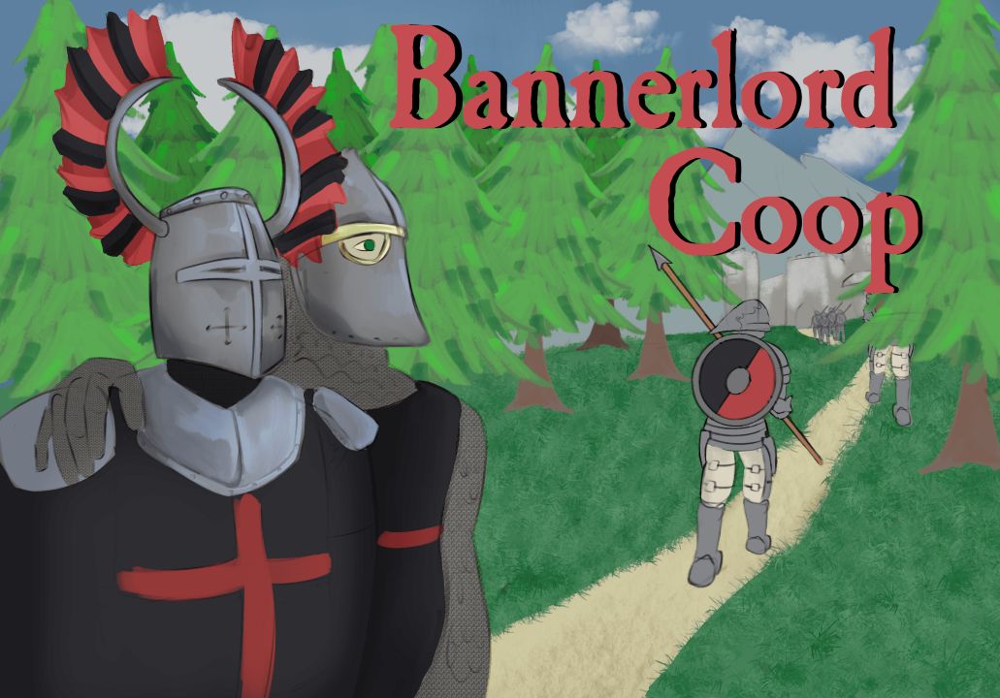

# Bannerlord Coop

**Experience the Mount & Blade II: Bannerlord campaign with your friends.**

Build armies, manage kingdoms, fight battles, trade, raid settlements, and conquer Calradia together in a shared multiplayer campaign.

[Steam Workshop](https://steamcommunity.com/sharedfiles/filedetails/?id=3770450698) &nbsp;•&nbsp;
[Discord](https://discord.gg/VXqGyT8) &nbsp;•&nbsp;
[Reddit](https://www.reddit.com/r/BannerlordCoop/) &nbsp;•&nbsp;
[Support the project](#support-bannerlord-coop)

## About the Mod

Bannerlord Coop transforms Bannerlord's single-player campaign into a cooperative multiplayer experience.

Players share the same persistent campaign world while controlling their own characters, parties, clans, troops, and resources. Travel across the campaign map together, interact with settlements and NPC parties, or fight alongside — and against — other players.

The mod is currently optimized for campaigns with up to **8 players**. Larger groups may work, but could experience reduced performance and stability.

## Installation

Subscribe on the [Steam Workshop](https://steamcommunity.com/sharedfiles/filedetails/?id=3770450698), then enable the **Coop** module in the Bannerlord launcher.

Join our [Discord](https://discord.gg/VXqGyT8) for installation help, announcements, bug reports, playtests, and community discussion.

## Hosting

For the best performance and stability, we strongly recommend hosting campaigns through the included **dedicated server**. [The hosting instructions can be found in our Discord through this link.](https://discord.gg/2MRuH9fVVV)

Steam hosting does not require traditional port forwarding in most cases. Manual network hosting options are also available.

Server setup walkthrough: https://www.youtube.com/watch?v=laZM967Eals

## Current Features

- Shared campaign map
- Player and AI movement synchronization
- Map encounters
- Party and troop management
- Character skills and progression
- Clan and kingdom management
- Settlement management
- Recruitment and trading
- Caravans and villager parties
- Smithing
- Player captivity
- Field battles
- Village raids
- PvE and PvP combat
- Simulated battles
- Players visible inside locations such as taverns and village scenes
- Dedicated server support
- Steam integration

### Experimental Features

- Sieges and sally-outs
- Armies

### Planned Features

- Additional campaign systems and stability improvements
- Hideouts
- War Sails DLC support
- Quests

Planned items and release priorities may change as development continues.

## Multiplayer Battles

Players can participate in field battles and sieges as allies or opponents. AI parties may also join active battles under supported campaign conditions.

Players who retreat or disconnect are handled by the campaign and battle synchronization systems, allowing the shared game to continue without ending the entire session.

## Compatibility

For the most reliable experience:

- Use the supported Bannerlord game version (currently **v1.4.7**)
- Disable all other mods
- Do not enable the War Sails DLC
- Ensure every player is using the same mod version

Compatibility with other mods is not guaranteed.

## Feedback and Bug Reports

Please share your honest experience with the mod — good or bad. Detailed feedback and reproducible bug reports are extremely valuable and help us improve stability, performance, and gameplay.

Report bugs in our [Discord](https://discord.gg/VXqGyT8) or via [GitHub issues](https://github.com/Bannerlord-Coop-Team/BannerlordCoop/issues), and please include:

- What happened
- What you expected to happen
- Steps that reproduce the problem
- Relevant screenshots, videos, or log files
- The number of connected players

## Support Bannerlord Coop

Bannerlord Coop is developed by a volunteer team and will always be available for free.

Support helps cover development tools, hosting infrastructure, dedicated servers, distribution costs, and other project expenses. Choose whichever platform works best for you:

- [**Patreon**](https://www.patreon.com/c/bannerlordcoop) — Become a monthly supporter
- [**Buy Me a Coffee**](https://buymeacoffee.com/bannerlordcoop) — Send a one-time contribution
- [**PayPal**](https://www.paypal.com/donate/?hosted_button_id=KHBSK4FXQ9GKS) — Donate directly
- [**Afdian**](https://ifdian.net/a/BannerlordCoop) — Support us from China
- [**Boosty**](https://boosty.to/bannerlordcoop/donate) — Additional international support option

**Financial support is completely optional.** Playing the mod, reporting bugs, creating content, and sharing Bannerlord Coop also help the project tremendously.

## Contributing

Get started [here!](https://github.com/Bannerlord-Coop-Team/BannerlordCoop/wiki/Getting-Started-as-a-Contributor) Also join our [Discord](https://discord.gg/VXqGyT8) for direct questions and collaboration.

By submitting a contribution to BannerlordCoop, you agree that your contribution
may be used, modified, distributed, sublicensed, and relicensed by the
BannerlordCoop project maintainers as part of the BannerlordCoop project.

You also confirm that you have the right to submit the contribution and that it
does not knowingly include code copied from another project without permission.

## FAQ

Please read through [the #faq channel in our discord server](https://discord.gg/VXqGyT8).

## License

Bannerlord Coop is source-available, not open source. The code may be viewed and contributed to, but it may not be copied, redistributed, relicensed, or used in another project without written permission from the maintainers. See [LICENSE](LICENSE) and [NOTICE.md](NOTICE.md) for the full terms.

## Credits

- Trailer by [medievalsniper](https://www.youtube.com/@medievalsniper9)
- Artwork by [timbermold](https://www.instagram.com/timbermold/)

### Acknowledgments

- Zetrith for [Multiplayer](https://github.com/Zetrith/Multiplayer).
- Salminar for [NoHarmony](https://github.com/Salminar/NoHarmony).
- ashoulson for [RailgunNet](https://github.com/ashoulson/RailgunNet).

---

**Now go — conquer your friends' castles!**
