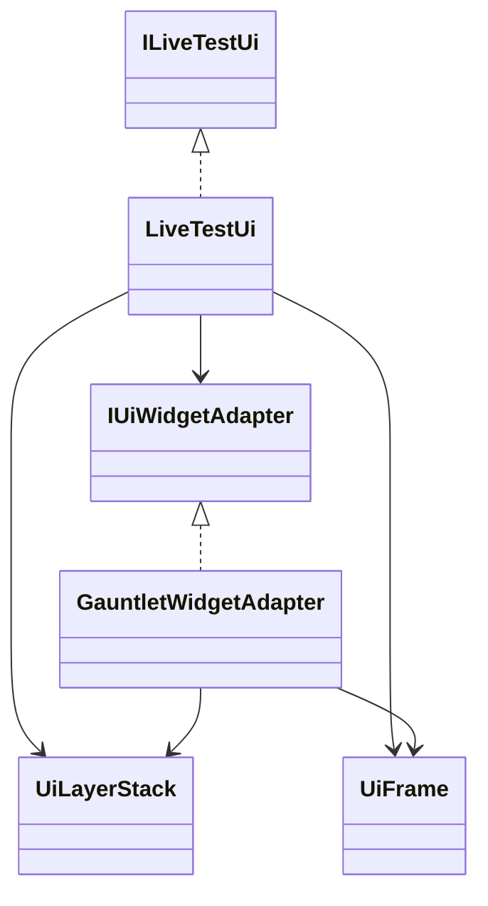
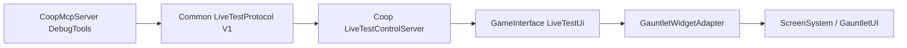

# Bounded layer-scoped UI inspection (DEBUG)

**Review candidate, not approved for deployment.** The blocked synthetic press/release implementation has been removed. Button actions now invoke the installed native semantic activation method directly after complete preflight. Independent review, integration with the richer published MCP server, and parent-owned native verification are still required. Managed tests are not native campaign acceptance.

The MCP server 1.1.0 adds `ui_layers`, `ui_inspect` and `ui_action`. The bridge adds `ui-layers` and an optional `layer` parameter on `ui-inspect`; existing `ui-inspect` without a layer and `ui-action` keep their wire shape. The named-pipe protocol stays V1. Status reports `uiCapability: bounded-ui-layers-v1`; the Coop assembly carries `CoopLiveTestUiCapability` with that value. The existing `CoopLiveTestCapabilities: staged-ui-capture-v1` metadata is unchanged for older consumers. An older bridge does not implement discovery or selected inspection: check the capability before sending the new requests.

## Contract and bounds

- Discovery reads at most 128 sorted layers, 128 immediate root children per layer, and 128 movie identifiers per layer. It bounds the source layer counts before requesting the native sorted list. It never walks widget descendants. Layers with more than 128 immediate root children have no selectable handle; compatible all-layer inspection can still read them under its normal widget budget. Exceeding the layer or movie limit fails discovery closed.
- Handles are opaque, bridge-local, expire after 30 seconds, and are invalidated by rediscovery, an action, or observed screen, focus, layer order/activity/restriction, context root, movie root, or bounded immediate-root changes. Discovery invalidates old widget snapshots. Discovery is not a promise that inspection will produce an actionable domain.
- New inspection accepts an explicitly observed `layer` handle, or omits it for all layers. Pagination uses the returned `snapshot` and `nextOffset`; changing the scope while paging is rejected. The page size remains 128. The aggregate selected context plus relevant upper-layer domains share the existing 16384-widget budget and depth 48 limit. The selected snapshot returns only selected-context widgets, along with `domainWidgets` and `scopeComplete`.
- A context is indivisible: all its root descendants are inspected, including invisible widgets and other movies. Sharing that context with another layer, encountering foreign-context descendants or detached movie roots, or finding an unknown blocking layer disables actions. No temporary reparenting, context replacement or virtual-layer hit test bypass is used.
- Relevant upper layers must have a mouse-button/wheel usage mask. Every such Gauntlet context must be fully bounded before native hit testing. Inactive/finalized layers cannot block; lower layers cannot block a higher selected layer. Maskless upper layers cannot change the native blocking result and are not hit tested. Unknown potentially blocking layer types fail closed instead of calling an unbounded virtual method.
- Before each action, inspection runs again over the current complete domain. Selected hierarchy/content/visibility/enabled state and upper modal-domain changes invalidate the snapshot. Current hit testing must still reach the visible, enabled, unclipped, uncovered, unredacted control. Truncated content remains non-actionable. Passwords and their descendants remain redacted. Native dispatch consumes snapshot and layer references before invoking any action; uncertain outcomes must not be retried.

## Actions: semantic activation, not physical input

`click` calls `ButtonWidget.HandleClick()` through the existing publicizer, only for the **exact** `TaleWorlds.GauntletUI.BaseTypes.ButtonWidget` runtime type. `toggle` uses that same operation when the requested 0/1 selection differs; an already matching selection consumes the request without invoking it. Normal, toggle and radio buttons retain the native click-handler, selection, parent-container notification, `Click`, `DoubleClick` and timestamp semantics. Unknown button subclasses are neither advertised nor dispatched, in either scope. The installed Native `Information/Inquiries/SingleQueryPopup.xml` declares exact `ButtonWidget` for `SingleQueryOkButton` and `SingleQueryCancelButton`; the installed generated `SingleQueryPopup__TaleWorlds_MountAndBlade_ViewModelCollection_Inquiries_SingleQueryPopUpVM.CreateWidgets` also constructs both with `new ButtonWidget(context)`. There is no inquiry-specific selector or VM call.

This deliberately changes the old all-layer click behavior too: no synthetic pointer movement, mouse override, pressed visual/property callbacks, mouse capture, focus changes, press/release events or cancellation. Native mouse/alternate/drag state and the button's pressed/click state must be idle before activation; existing input is not cleared. This is not a test of physical input or keyboard/controller navigation. Native click keys still take the press/release route. An installed non-pointer use exists in `PartyHeaderToggleWidget.UpdateSize`, which calls inherited `HandleClick` to open its collapsed list; that subclass is NOT added to the supported list.

The bridge performs no traversal or native-object read after `HandleClick` starts, and does not run cleanup on an old context. Root replacement or a new modal during the intended activation is a normal possible result. The native method itself still continues through all of its semantics: a first handler can change selection, children, parents or handlers before later handlers run. Those are native callback effects, not bounded bridge traversal. In particular, handler-list mutation can throw after a successful side effect. Every exception from activation is wrapped as an uncertain native failure (including bridge-shaped exceptions), and the pipe reports `outcomeUncertain: true`; consumed references cannot be retried. No guarantee is made that all gameplay callbacks finish, avoid exceptions, or execute within the traversal cap.

`UIContext.OnFinalize` calls subsystem finalization; `EventManager.OnFinalize` clears its containers/callback list, but does not null `Widget.Context`, `UIContext.EventManager` or the manager's `Time`. Thus ordinary root replacement/finalization alone does not invalidate base `HandleClick`'s post-Click timestamp read. This is not a guarantee about every game callback or Harmony modification. Tests exercise both replacement during the first handler and manager finalization during the `Click` event, plus throwing handler-list mutation; they do not substitute for an actual inquiry run.

Selected-layer snapshots advertise only these button actions. Text and slider actions are rejected scoped because `FocusedWidget` changes invoke focus callbacks, setters notify bindings, and the old bridge then clears focus in `finally` against possibly changed UI. `RealText` itself also continues updating visible text after notifying its first binding. Scrolling queues interpolation for a later tick and has not been proven to stay in the selected context through scrollbar callbacks. Existing all-layer non-button behavior is retained, not newly certified for mutation-during-callback safety. Use only the returned `actions` array; an empty array is inspection-only.

## Native contract examined

Installed `ScreenManager.SortedLayers` sorts ascending by `ScreenLayer.CompareTo` (restriction order then id). `IsLayerBlockedAtPosition` visits layers from highest down, returns unblocked when it reaches the target, and blocks only after an upper active, non-finalized hit with a mouse-button/wheel mask. It nevertheless calls `HitTest` on maskless layers; the adapter avoids those irrelevant calls.

`GauntletLayer.HitTest(position)` iterates movie roots. `UIContext.Root` is `EventManager.Root`; `GetWidgetAtPositionForEvent` always collects from that entire root, not the selected movie. `CollectEnableWidgetsAt` visits enabled/visible children in reverse order subject to measured-area/event flags, then `PreviewEvent` chooses the native receiver. `AnyWidgetsAt`, used for layer blocking, recursively checks movie roots. A movie-sized snapshot therefore cannot safely authorize native event dispatch. The adapter first proves movie roots are inside the completely inspected context and validates context identity for every visited widget.

The discovery envelope records native layer/root/movie identities, not descendant content. Content is observed by selected inspection, then revalidated before dispatch; no assertion is made that a discovery handle freezes a widget tree.

## Validation boundary

Managed tests cover native managed widget traversal/click binding, selected roots, huge ignored backgrounds, shared contexts, detached movie roots, dynamic upper blockers, stale layer/modal roots, limits, one-shot references, redaction and malformed tool arguments. Builds are compile-only. No game process, live deployment, save, fixture, helm input or physical/authority behavior is changed by this extension. Actual campaign modal discovery and dismissal still require the parent-owned native run after independent review.

## Integration gate

Do not replace the published 17-tool server from `BannerlordCoop-mcp-options` with this older standalone 14-tool output. The narrow integration contract is additive: `ui_layers(run_id, instance)` sends `ui-layers {}`; `ui_inspect` gains an optional opaque `layer` while preserving `run_id`, `instance`, `snapshot` and `offset`; `ui_action` retains its wire parameters and needs the semantic-action description above. Retain published `preflight`, `start_client`, `capture_screenshot`, `list_saves` and all other existing tools and routing behavior. The unpublished integration patch must be rebased and tested by the owning peer; its source match is not proof of compatibility with the running binary. Protocol V1 and `bounded-ui-layers-v1` remain unchanged. Capability alone does not identify this fix; verify the reviewed source/DLL freeze identities before parent-owned runtime testing.
