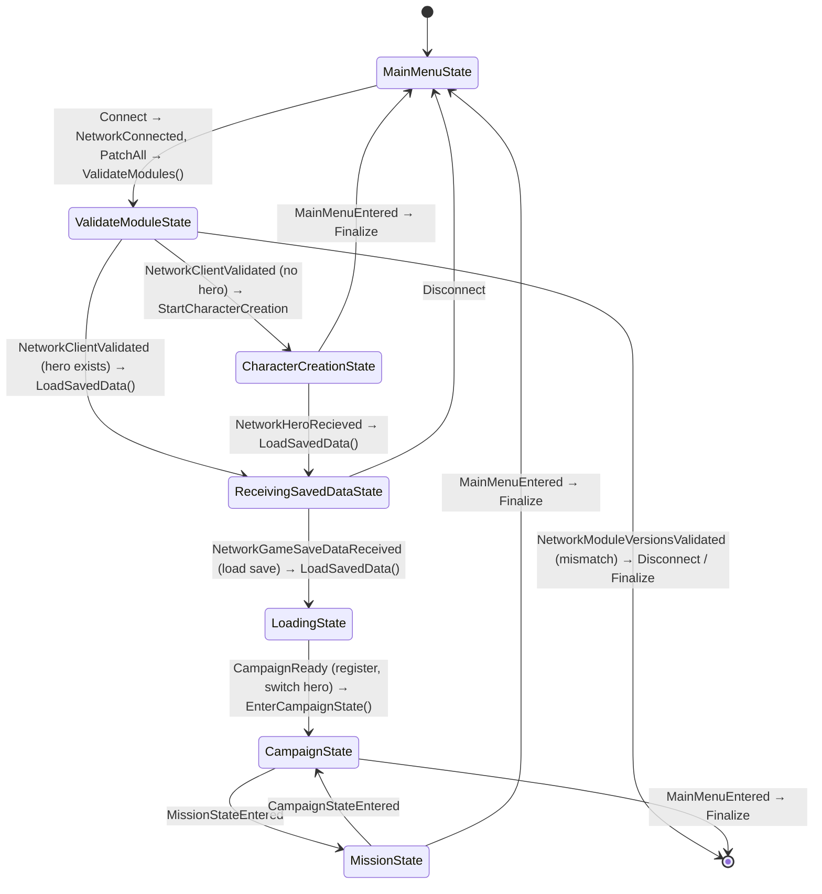
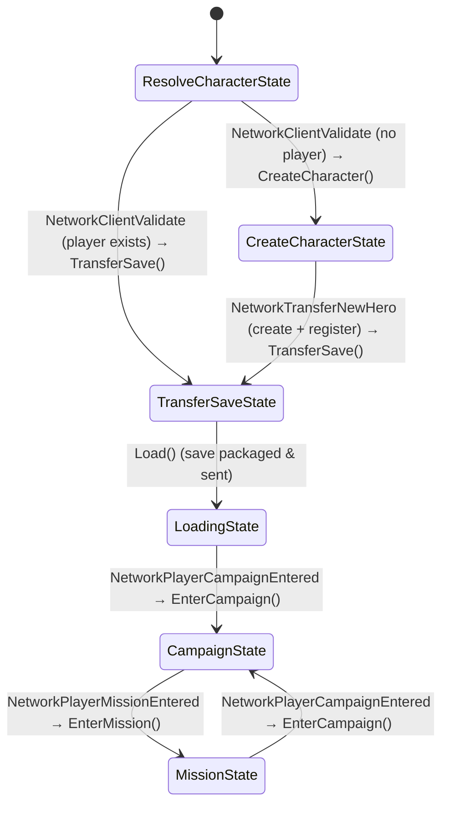
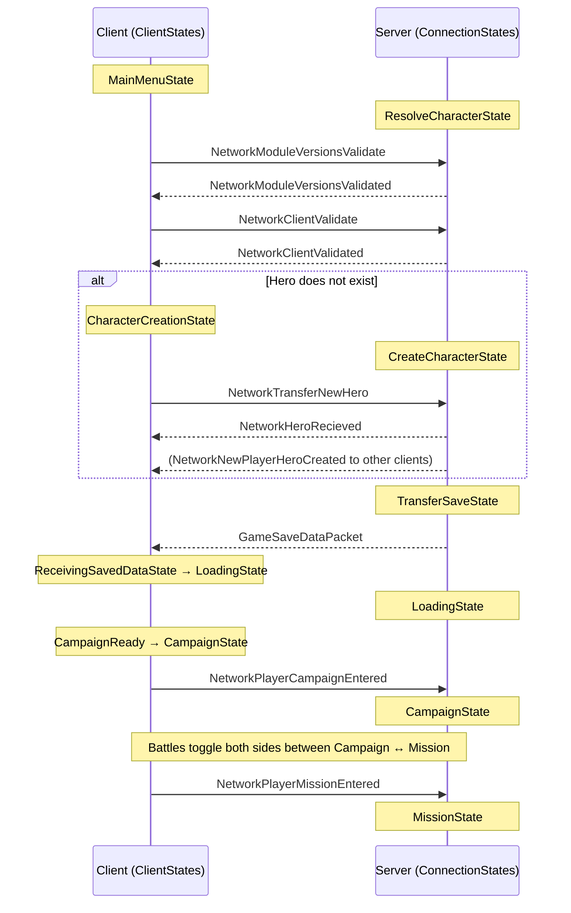

# Client & Connection State Machines

Bannerlord Coop drives the join/play lifecycle with two cooperating state machines:

- **ClientStates** — runs on the joining client ([`ClientLogic`](../source/Coop.Core/Client/ClientLogic.cs), states under [`Coop.Core/Client/States`](../source/Coop.Core/Client/States)). One per client.
- **ConnectionStates** — runs on the server, **one instance per connected client** ([`ConnectionLogic`](../source/Coop.Core/Server/Connections/ConnectionLogic.cs), states under [`Coop.Core/Server/Connections/States`](../source/Coop.Core/Server/Connections/States)).

Both implement a simple `SetState<T>()` pattern: the `Logic` object holds the current state, forwards interface calls to it, and each state decides which transition to perform (usually in response to a `Network*` message arriving over LiteNetLib). Transitions labelled `Network…` below are messages received over the wire; the rest are local `Logic.*()` action calls.

---

## ClientStates (client side)

| State | Waits for | On success |
|-------|-----------|------------|
| `MainMenuState` | `NetworkConnected` | Patch game, validate modules → `ValidateModuleState` |
| `ValidateModuleState` | `NetworkModuleVersionsValidated`, `NetworkClientValidated` | Branch on whether a hero already exists |
| `CharacterCreationState` | `CharacterCreationFinished`, `NetworkHeroRecieved` | Send new hero, then receive saved data |
| `ReceivingSavedDataState` | `NetworkGameSaveDataReceived` | Load host save → `LoadingState` |
| `LoadingState` | `CampaignReady` | Register objects, switch to player hero → `CampaignState` |
| `CampaignState` | `MissionStateEntered` | Enter battle → `MissionState` |
| `MissionState` | `CampaignStateEntered` | Return to map → `CampaignState` |

---

## ConnectionStates (server side, per client)

| State | Waits for | On success |
|-------|-----------|------------|
| `ResolveCharacterState` | `NetworkModuleVersionsValidate`, `NetworkClientValidate` | Validate modules, then branch on whether the player exists |
| `CreateCharacterState` | `NetworkTransferNewHero` | Unpack/register new hero, broadcast it → `TransferSaveState` |
| `TransferSaveState` | (constructor) | Pause time, save current game, send packet → `LoadingState` |
| `LoadingState` | `NetworkPlayerCampaignEntered` | Client is on the map → `CampaignState` |
| `CampaignState` | `NetworkPlayerMissionEntered` | Client entered battle → `MissionState` |
| `MissionState` | `NetworkPlayerCampaignEntered` | Client back on map → `CampaignState` |

---

## How the two machines interlock

The client and its server-side connection advance in lock-step by exchanging messages. The same handshake described above, viewed across the wire:

### Transition cheat-sheet

| Step | Client message out | Server message out |
|------|--------------------|--------------------|
| Module check | `NetworkModuleVersionsValidate` | `NetworkModuleVersionsValidated` |
| Client/hero check | `NetworkClientValidate` | `NetworkClientValidated` |
| New character | `NetworkTransferNewHero` | `NetworkHeroRecieved` (+ `NetworkNewPlayerHeroCreated` to peers) |
| Save transfer | — | `GameSaveDataPacket` |
| Joined map | `NetworkPlayerCampaignEntered` | — |
| Entered battle | `NetworkPlayerMissionEntered` | — |
