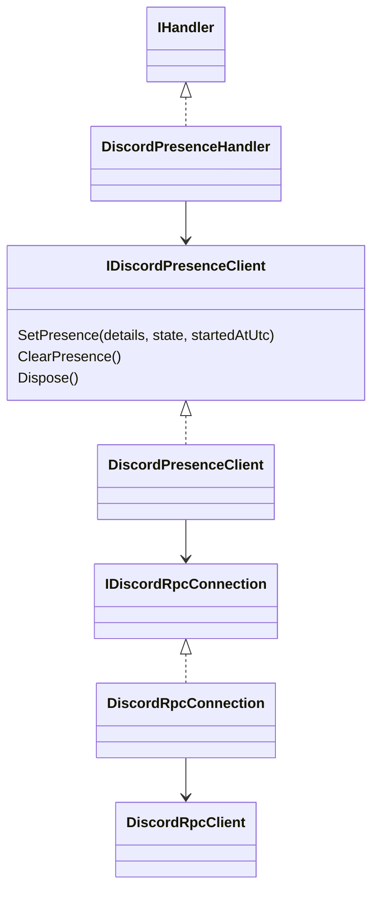
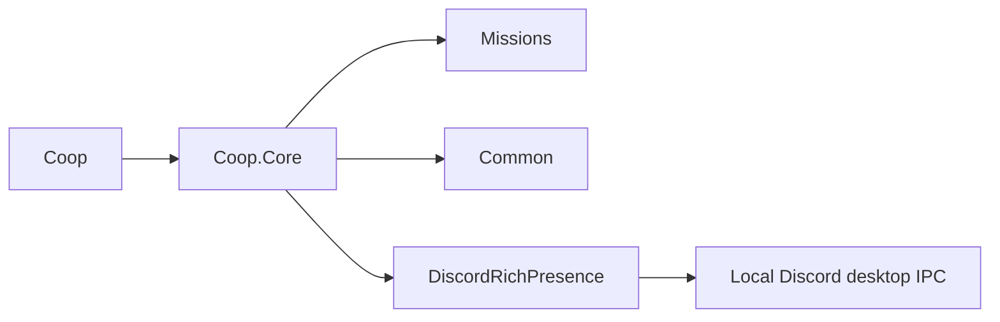

# Discord Rich Presence

## Portal setup

1. Open application **1546158363480690738** in the [Discord Developer Portal](https://discord.com/developers/applications).
2. Set its application name to **Bannerlord Coop**. Discord supplies the activity title from this name, not the executable name.
3. Under Rich Presence assets, upload the supplied Bannerlord Coop artwork with key **`bannerlord_coop`**. This is a manual portal step; the mod does not upload artwork. Use the portal's supported image dimensions and crop/resize the supplied wide image if needed.
4. Run the Discord desktop app and enable activity sharing in its settings.

The mod publishes `In a co-op campaign` or `Fighting a battle`, `1 player` / `N players`, and a start timestamp. Discord renders the elapsed timer and controls the exact layout. There are no join buttons, invites, bot credentials, server endpoints, or player names in the activity.

## Behavior and implementation

Presence starts only after the local client's campaign join catch-up completes. Its timestamp starts at network connection and stays unchanged across battle entry/exit and player-count updates. Disconnect, returning to the main menu, session disposal, or module shutdown clears it. A new connection gets a new timestamp. Dedicated servers never register the presence service.

The count comes from `NetworkConnectedPlayersChanged`: the server's `ConnectionCollection` counts connected client peers, including the local client and clients still loading, but not the server. Do not add one for self or host. Until a count arrives, a connected client knows about one player: itself.

`CampaignState.CompleteCampaignEntry` publishes `ClientCampaignReady` after join synchronization. Local `CoopBattleController.AfterStart` already publishes `BattleMissionReady`; controller disposal now publishes `BattleMissionEnded`, including normal retreats/aborts. A mission that fails before readiness never advertises battle status. Settlement visits and other players' battles do not change the local status. Disconnect clears status even when mission teardown does not finish.

`DiscordPresenceHandler` is autoactivated through the client module's existing `IHandler` registration. Its state is locked because network and game events run on different threads; it reads no game objects. It suppresses duplicate updates. `DiscordPresenceClient` serializes library calls on the thread pool, including cleanup, and retains its own latest activity. The library's READY callback runs after automatic synchronization; it queues a reapply of the latest activity (including a clear), otherwise a concurrent library sync could restore stale status. `DiscordRpcConnection` exposes that callback through a fakeable seam and is disposed only by the adapter's queue. Lachee's [DiscordRichPresence](https://github.com/Lachee/discord-rpc-csharp) **1.6.1.70** handles local IPC, background retries and reconnect state synchronization. Routine pipe failures use its silent default logger; unexpected adapter failures log once per session.

The package targets .NET Standard 2.0, compatible with `Coop.Core` and the .NET Framework 4.7.2 mod. `CopyLocalLockFileAssemblies` and project-reference copying put `DiscordRPC.dll` and its transitive dependencies in the Coop output. The existing `Deploy.targets` DLL glob includes them; no custom deployment step is needed.





## Checks

- Start a dedicated server with Discord open: it must not publish this activity. Join from a client: no campaign activity during save transfer/catch-up, then `In a co-op campaign`, `1 player`, and elapsed time.
- Connect two more clients: the count becomes `3 players`. Disconnect one: it becomes `2 players`. Hosting through the menu still counts the launcher only as its playing client, not the separate server.
- Enter a co-op field or siege battle: `Fighting a battle`, without resetting elapsed time. Retreat or finish: campaign status returns with the same timer. Another client's battle must not change the observing campaign client's status.
- Visit Danustica (`town_ES1`) and its tavern: keep campaign status, not battle status.
- Disconnect during campaign and during battle, return to the main menu, and exit the game: presence clears. Rejoin: a fresh timer. Cancel or fail a join: no campaign presence.
- Start a session with Discord closed, then open Discord. Close and restart Discord during campaign and during battle. Presence should recover without gameplay stalls; allow up to about a minute for the library's retry backoff and Discord's own display delay. Check `Coop_client.log` for repeated failures.
- Verify uploaded artwork, title and formatting in another Discord user's view, including interaction with automatic vanilla Bannerlord detection. Activity sharing settings may hide the activity.

Compile without deployment from a Windows shell (set `SolutionDir` to the worktree's `source` directory when restoring this legacy project):

```powershell
$solutionDir = (Join-Path (Get-Location) 'source') + '\'
MSBuild.exe source\Coop\Coop.csproj -restore -p:RestorePackagesConfig=true "-p:SolutionDir=$solutionDir" -p:Configuration=Release -p:Platform=AnyCPU -p:PostBuildEvent= -p:ModName=
dotnet test source\Coop.Tests\Coop.Tests.csproj -c Release --filter "FullyQualifiedName~DiscordPresenceClientTests|FullyQualifiedName~DiscordPresenceHandlerTests|FullyQualifiedName~CampaignStateTests|FullyQualifiedName~ConnectedPlayerCountServerHandlerTests"
```

`PostBuildEvent=` alone does not suppress the current deployment target; `ModName=` also disables `DeployToGame`.
