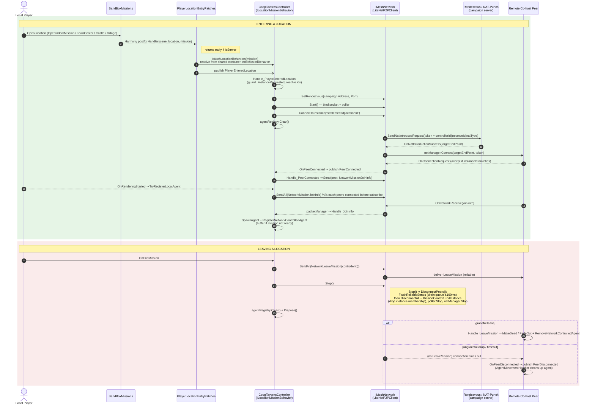

# Entering / Leaving a Location over the `IMeshNetwork`

How co-located players are connected while inside an interior (tavern, town centre,
castle courtyard, village) in BannerlordCoop, focused on the mission-scoped peer-to-peer
network, `IMeshNetwork`.

---

## 1. The core mental model

A location interior is **owned locally by the player who walks into it**. The campaign
server has no main party strolling into a tavern, so it never opens an interior mission
for itself. Two players who happen to be in the same settlement location are connected
to each other directly — not through the campaign server — over a separate, mission-scoped
P2P network.

That network is `IMeshNetwork` (concrete implementation `LiteNetP2PClient`). It is
deliberately distinct from `CoopClient`'s campaign `INetwork`:

> The mesh network is registered `As<IMeshNetwork>` (**not** `As<INetwork>`) in
> [`MissionModule`](../source/Missions/MissionModule.cs) so mission services bind to it
> explicitly and it does not collide with `CoopClient`'s `INetwork` in the shared client
> container.

Key properties:

- **Pure NAT punch** in the live co-host path — `ConnectToInstance` sends a NAT introduce
  request; no connection to the server is opened (`PeerServer` is null). The campaign
  server is used only as the rendezvous, pointed at via `SetRendezvous`.
- **The instance id is computed locally** as `settlementId|locationId`. Both co-located
  clients independently derive the same id, so no assignment round-trip is needed — the
  server creates the instance on the first NAT punch.
- **Exit is a full teardown** (`Stop()`), but reliable sends are flushed first so the
  graceful `NetworkLeaveMission` broadcast reaches peers before `DisconnectAll` cuts the
  link. The timeout path is the ungraceful fallback.

---

## 2. Flow diagram

---

## 3. Concrete layout

| Concern | Type | File |
|---|---|---|
| Mesh network interface | `IMeshNetwork` | [`source/Missions/Services/Network/IMeshNetwork.cs`](../source/Missions/Services/Network/IMeshNetwork.cs) |
| Mesh network implementation | `LiteNetP2PClient` | [`source/Missions/Services/Network/LiteNetP2PClient.cs`](../source/Missions/Services/Network/LiteNetP2PClient.cs) |
| Entry trigger (Harmony postfix) | `PlayerLocationEntryPatches` | [`source/GameInterface/Services/Locations/Patches/PlayerLocationEntryPatches.cs`](../source/GameInterface/Services/Locations/Patches/PlayerLocationEntryPatches.cs) |
| Connection / join / leave owner | `CoopTavernsController` | [`source/Missions/Services/Taverns/CoopTavernsController.cs`](../source/Missions/Services/Taverns/CoopTavernsController.cs) |
| DI registration | `MissionModule` | [`source/Missions/MissionModule.cs`](../source/Missions/MissionModule.cs) |

---

## 4. Notes and edge cases

- **Attach before publish.** `PlayerLocationEntryPatches.AttachLocationBehaviors` adds the
  `ILocationMissionBehavior`s (`CoopTavernsController`, `CoopMissionNetworkBehavior`) to the
  freshly-opened mission *before* `PlayerEnteredLocation` is published, so the controller is
  alive and subscribed when it owns the instance request and join exchange. `OpenIndoorMission`
  fires several times per entry, so attachment is deduped via a `ConditionalWeakTable`.
- **`%` is reserved.** The instance id uses a `|` separator, not `%` — `ConnectionToken`
  serializes as `PeerId%InstanceId%NatType` and splits on `%`.
- **Join info can beat mission setup.** On a rejoin the kept-alive socket can deliver a peer's
  join info before the local interior mission has finished initializing teams/player agent.
  Early join info is buffered (`_pendingJoinInfos`) and drained once `TryRegisterLocalAgent`
  succeeds — spawning a remote agent into a not-yet-initialized mission corrupts team setup.
- **Network thread vs. main thread.** `Handle_JoinInfo` runs on the network thread, but
  `AgentBuildData`'s ctor and `SpawnAgent` touch TaleWorlds engine statics that must run on the
  main thread, so the entire build+spawn happens inside a `GameLoopRunner.RunOnMainThread` closure.
- **Leave reliability.** `FlushReliableSends` nudges the logic thread and waits (bounded to
  100 ms) for each peer's reliable queue to drain, so the queued `NetworkLeaveMission` is
  delivered before `DisconnectAll`. The `OnPeerDisconnected` / timeout path remains the fallback
  for ungraceful exits.
