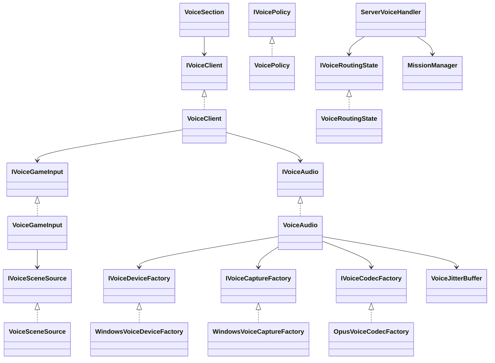
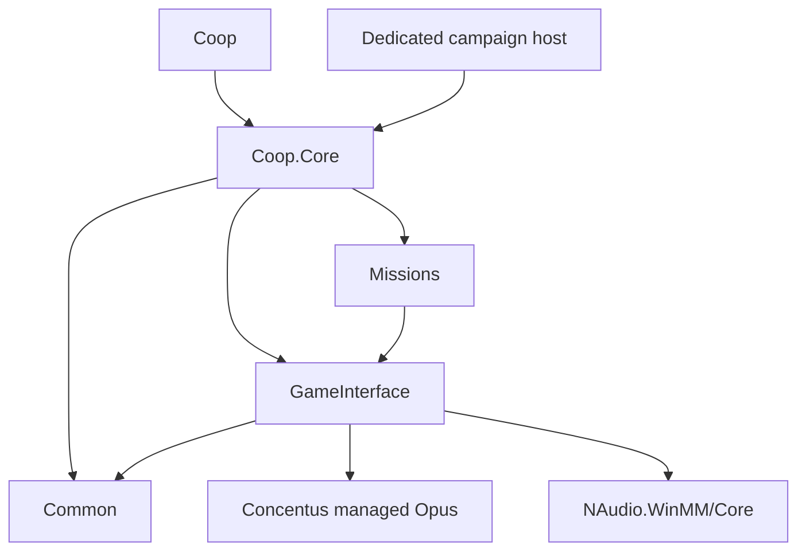

# Proximity voice

Voice is relayed by the existing co-op campaign connection. No extra port, external account, voice service, or mission-host connection is required. Everyone nearby can hear, regardless of allegiance. Audio is centered mono; there is no directional audio, occlusion, or per-player control.

## Controls

Open **Coop Options / Voice** after joining. The top **Enable voice chat** checkbox turns all voice input and playback on or off immediately, retaining the microphone, speaking mode, volume, and binding. It defaults on for existing settings; an older Disabled speaking mode migrates to voice off. Choose Push to talk or Voice activation from the Speaking mode dropdown. Input groups the microphone selector, native keybinding row, mute checkbox, and activation-threshold slider. Deafen sits directly below Mute microphone. Playback groups the volume slider and Show talking players checkbox. Microphone test has a single Test microphone / Stop button and live status below. A vertical input-level meter beside the test controls rises from green through yellow to red at peak; it measures captured audio, not the playback volume setting. It drops to zero when silent or capture is unavailable and does not open the microphone or bypass normal capture permissions. Threshold controls are enabled only for Voice activation; lower values pick up quieter speech.

Push-to-talk defaults to **Q** and is independent of vanilla controls:
- Click the voice key, release a keyboard key or mouse button in Bannerlord's normal keybinding popup, and the accepted key is saved immediately.
- Escape or popup Cancel leaves the binding unchanged. **Reset to Q** saves Q immediately. Closing options keeps accepted changes; canceling the keybinding popup does not change the saved key.
- Missing or invalid saved keys fall back to Q. Escape, mouse-wheel impulses, and controller keys are not accepted as the keyboard/mouse binding.
- Controller PTT remains fixed to **D-pad right**. Keyboard rebinding is disabled while controller input is active, matching vanilla.
- Transmission is suppressed during capture and its closing frame, including voice activation and controller PTT.

Choose a microphone, set the activation threshold (lower means more sensitive) and voice volume, with each change saved and applied immediately. Voice controls save and apply immediately; closing the menu or choosing **Cancel** does not roll back accepted Voice changes. Other Coop Options tabs keep their changes staged until **Apply**. Microphone mute prevents transmission. Deafen prevents both hearing and transmission. Turning Enable voice chat off closes voice devices and disables both directions. Settings are local, in `Documents/Mount and Blade II Bannerlord/Configs/BannerlordCoop/coop_options.json`, under `VoiceTab/VoiceSection`.

**Test microphone** plays capture locally for five seconds and never sends test audio. The same button reads **Stop** while testing and returns to **Test microphone** at expiry or failure. Clicking **Stop**, turning voice off, closing options, or leaving the session stops the test. A microphone error leaves reception available; an output error requires reopening playback too. If a numbered device has disappeared or changed name, select it again rather than silently switching to another microphone. Device errors stay in the voice settings and log; gameplay continues.

Transmission stops while unfocused or typing in co-op chat/an editable UI field. A microphone is never opened by the server. Use headphones for voice activation; this implementation does not cancel loudspeaker echo.

## Talking players and server control

The left-side Talking list shows hero names only after audible remote speech is submitted for playback. Silence and zero-volume frames do not light it. Names expire after 200 ms without speech; context changes, deafen, server disable, microphone test, and stale local sampling hide them. Show talking players is a local, default-on, immediately saved visibility preference, not a voice permission. The list is noninteractive and hidden in full-screen menus, options, conversations, loading, and photo mode.

The server's `modOptions.voiceEnabled` in `mod-config.json` defaults to `true`. Set it to `false` before starting the session to disable voice for everyone, including future joins. Change the running session from the server console:

```text
coop.debug.mod_config.voice_enabled false
coop.debug.mod_config.voice_enabled true
```

The command broadcasts the authoritative setting and discards queued relay speech. Clients stop capture/transmission, close output, clear the talking list, and preserve their personal settings. Re-enabling requires fresh contexts before relay resumes. Commands are session-only; the startup file controls the next session and is not rewritten.

## Server distances

Add or edit this block in `mod-config.json`; restart the session to apply it:

```json
"voice": {
  "mapFullVolumeDistance": 5,
  "mapMaximumDistance": 20,
  "sceneFullVolumeDistance": 10,
  "sceneMaximumDistance": 50
}
```

Map distances use campaign-world coordinates, independent of zoom. Scene distances use scene coordinates. Volume is full through the first distance and fades linearly to zero at the maximum. Each maximum must be finite and greater than its nonnegative full-volume distance. An invalid block logs a warning and uses the defaults above. These ranges come from the server after campaign synchronization, not from the listener's local config.

- Map: own player party position, including settlement menus without a mission. Nearby parties outside or in settlement menus can hear and speak to each other. Entering a mission or a map battle disables campaign hearing and transmission.
- Settlement location: only the same settlement/location instance can communicate.
- Battle: only the same map-event instance can communicate.
- Tournament: uses the existing tournament mission instance, separate from the settlement location and other tournaments.
- Living active participants listen and speak from their agent. Dead players and tournament spectators listen from their camera and cannot transmit, even if a tournament spectator has a living agent.
- Loading screens, unknown/non-co-op mission instances, and missing player identities are silent.

## Integration

`Common/Voice` contains wire contracts and testable routing, distance, input gating, transit-age, and jitter policies. `ServerVoiceHandler` validates player identity and authoritative campaign positions on the game thread. Scene routing also checks `MissionManager` membership. `VoiceGameInput` samples the game thread; `VoiceSceneSource` reads existing battle/location/tournament identities. The audio thread receives immutable snapshots, never game objects.





Voice uses unreliable packets, not reliable world-message batching or P2P relay. Reliable context epochs establish permission; early unordered audio is dropped rather than establishing a context. Audio carries a separate sequence from position heartbeats and is stamped with the recipient's epoch. Scene/deafen transitions and explicit microphone-test resets invalidate device callbacks and recreate capture and output. Output disposal resets samples already submitted to Windows, not just the software provider buffer. Microphone-only failure/retry retains healthy output. Speaker identity is the authenticated registered platform-backed controller id, not the hero name or a random connection id. A separate server-issued stream generation increases on reconnect. Receivers reject retired generations even after decoder expiry or context/test resets, while a new generation accepts the reconnecting sender's reset epoch/sequence. A bounded history retains the most recent 100 platform identities without evicting active speakers. Hero names are resolved from the player registry only on the presentation/game thread. The server bypasses join replay queues for speech. Disconnect removes relay membership; client scope disposal joins the audio worker and closes devices.

Mono Opus uses 48 kHz, 960 samples/20 ms, approximately 24 kbps. Each encoded payload is at most 400 bytes. Per-speaker jitter targets 60 ms, retains at most ten frames, and conceals at most three missing frames before resetting. Capture/relay/receiver queues drop old work; no backlog is played after a stalled game frame. A rolling relative-clock baseline rejects packets delayed over 200 ms beyond observed transit time without requiring synchronized clocks. This is not an absolute network-latency guarantee. The mixer uses an absolute 20 ms deadline, bounded catch-up, and explicit stall reset instead of accumulating ordinary wake-up lateness. It limits output amplitude and caps decoder state at ten speakers. Supported release capacity is ten connected players, including up to ten simultaneous talkers.

### Both server modes

The in-game server registers `ServerModule` in `CoopartiveMultiplayerExperience.StartAsServer`. Its packet-handler scan registers `ServerVoiceHandler`.

The separate official `BannerlordCoop.DedicatedServer` checkout was inspected read-only at `6b0f73407157e2eb08f976de53a9b479fcfb4a7e`. `DedicatedServer.Core/Server/CoopDriver.cs:164-168` publishes `HostSaveGame`; `CoopServerHost.cs:312` invokes that entry and `:452` signals `CampaignReady`. It therefore loads this same server container. This repository's old `source/ServerConsole` is an IntroServer test launcher and was not modified. Actual dedicated-runtime voice testing remains required.

### Dependencies and distribution

`GameInterface.csproj` pins Concentus 1.1.7 and NAudio.WinMM 2.2.1 (NAudio.Core 2.2.1 transitively). Their managed assemblies support the netstandard2.0 projects and net472 game entry point. Windows audio calls occur only in the client service, not during server composition. The build output includes Concentus.dll, NAudio.WinMM.dll, NAudio.Core.dll and required Microsoft runtime dependencies.

Ship the entire `deploy/ThirdPartyNotices` directory. `Deploy.targets` includes it through its existing recursive static-file rule. Concentus's pinned NuGet metadata declares the BSD Opus license URL; its upstream copyright notice and NAudio's MIT notice are included. The notice README records version/source evidence and Opus patent-license links. These licenses do not relicense the mod's proprietary/source-available code.

## Coverage matrix

Automated means executed production code with test doubles where indicated, not a live-engine or microphone claim. Test classes are named after their source subject.

| Functional area | Automated evidence | Live gate still required |
|---|---|---|
| Wire framing/bounds/delivery | `VoiceRoutingStateTests`: actual ProtoBufSerializer round trip, 0/400/401-byte payloads, identity bounds, invalid epoch/coordinates, unreliable delivery | Network captures on both hosts |
| Full range/falloff/everyone | `VoicePolicyTests` asserts map and 3D scene/battle/tournament full/fade/zero boundaries; `ServerVoiceHandlerTests` uses real PacketManager, routing policy, player manager, and authoritative party coordinates | Hear equal volume across allegiances; measure fade while moving |
| Server config | `VoiceOptionsTests` validates defaults/bad ranges; `ServerVoiceHandlerTests` checks targeted join distribution | Restart host with different map/scene radii |
| Map vs settlement | Client campaign-position tests allow settlement menus but reject missions/battles/non-map screens; real relay tests cover menu speech both ways, authoritative distance boundaries, and mission membership rejecting stale campaign senders/listeners before heartbeat; client epoch tests cover leaving contexts | Actual `VoiceGameInput.Sample` reads live settlement/battle state, map zoom and menu transitions |
| Same scene/battle/tournament | Real MissionManager membership/revocation tests; `VoiceSceneSourceTests` projects actual session identities and reset | Actual mission-controller attachment and two different scenes/battles/tournaments |
| Agent/camera and spectators | `VoiceGameInputTests` checks agent/camera selection including living spectator; relay and client tests enforce receive-only | Death, knock-out, tournament spectator agent, camera movement |
| Epochs/order/expiry/reconnect | Routing/client/relay/transit tests reject early, old, expired, duplicate packets; client/relay/client test reorders reliable context and audio; worker rejects older speaker epochs after decoder eviction/retry; reconnect resets relay state | Repeated reconnect and rapid mission changes with induced packet delay |
| PTT remap/focus/chat/activation/mute/deafen | Dedicated Q/custom keyboard input and fixed-controller tests; native GameKeyOptionVM command/accept/reset tests; persisted and legacy/missing/invalid-key tests; native-popup coordinator capture/cancel/focus/close tests; generated native row plus both options entry-point wiring checks; pending-encode and closing-frame capture fences (PTT and voice activation); policy and production capture focus/chat/sensitivity tests | Physical keyboard/controller, alt-tab and real editable UI focus |
| Local settings/device choice | Real CoopOptionsStore persistence, selected device identity, sensitivity/volume/modes, invalid values | Enumerate/select two real microphones; numeric fields and tab layout |
| Microphone test/status/retry | Options delegates; real capture callback through Opus/sensitivity and local-only test playback; fake input open/async failures preserve receiving and retry without reopening output | Five-second local playback, unplug/replug, permission failure |
| Codec/playback/mixing/capacity | Real managed Opus roundtrip/PLC; real relay ten-player/90-delivery test, fake-device ten-speaker saturation/stall tests; sustained production-worker 25 ms wake-ups retain 20 ms frame throughput; eleventh decoder rejected | Ten simultaneous real streams, quality/CPU/latency/long-session drift |
| Jitter/loss/age | Startup reorder, duplicate/late frames, wrap, bounded PLC, capture queue pressure, ten-stream stall recovery, stale queues, relative-clock delay tests | Loss/jitter/burst traffic and no sustained buffering |
| Shutdown/late callbacks | Client/audio idempotent disposal, old callback generations, deterministic capture/error callbacks blocked on the real state gate during context change, old listener-epoch rejection, section finalization; separate provider/hardware queue model proves context/deafen/stop-test discards queued output while mic-only retry retains it, including callbacks during output disposal | Exit while recording/playback, disconnected device shutdown; confirm no queued speech after scene change/deafen/stop-test |
| DI and hosting | Real client/server ContainerBuildTests: client voice resolves unopened, server has no audio/client registration; read-only dedicated bootstrap proof | Dedicated Linux runtime loads managed dependencies without opening Windows devices |
| Packaging/licenses/UI assets | `VoicePackagingTests` checks pinned refs, notice files, deploy inclusion, generated Voice-tab commands and built managed dependencies; guarded Coop compile | Inspect final release archive and render UI in game |

Review regressions were also checked by temporarily reintroducing each defect: drifting deadlines, backwards epochs, pre-lock capture/error checks, missing final send settings gate, and combined capture/output failure each made its targeted tests fail. A later output-reset regression separately demonstrated that provider-only clearing leaves simulated hardware samples queued for all three context/deafen/stop-test cases; output recreation passes those cases while both microphone-only retry cases retain output. The fixed production paths pass. The earlier 235 passing results included existing suites, not 235 new voice-only tests.

The engine/hardware column is **unrun**. The automated suite is broad but does not establish release readiness by itself. The native scene-discovery calls, entire ten-client network path, and physical audio-device lifecycle still require live verification.

## Runnable live checklist (unrun)

Run only after the maintainer authorizes a test build/deployment. Use two separately joined clients, not the server as a player. Use headphones. Repeat this checklist on an in-game server and the real dedicated campaign host.

1. Open Coop Options / Voice on both clients. Select microphones, keep push-to-talk, and run the five-second local microphone test. The other client must hear none of the test. Stop/close the tab early and verify local test playback stops.
2. Meet outside **Danustica**, Southern Empire town `town_ES1`. Hold Q on one client. Move the other party near/far, then change map zoom without moving: zoom must not change voice volume. Have the second client speak too. Confirm no self-echo.
3. In **Coop Options / Voice**, click the key and release F12. Confirm the normal keybinding popup and key text match vanilla Controls. After accepting the key, F12 sends and Q does not. Reopen settings and restart the client to check persistence. Open the popup and cancel with Escape: F12 must remain saved. Accept F11 and close options: reopening must show F11. Use **Reset to Q** and confirm Q works again immediately. Change vanilla Push To Talk to F11: VOIP must still use Q, and the VOIP controls must not alter F11. Repeat the UI checks on the campaign options screen and the mission options overlay. While capturing a key, hold Q or controller D-pad right and try voice activation: none may transmit, including the cancel/closing frame. Alt-tab during capture and close the overlay during capture: the popup must disappear and input focus recover. Controller mode must disable keyboard rebinding while fixed D-pad-right PTT still works outside capture. Check a held mouse-button binding, too. Test voice activation thresholds, mute, deafen, disabled mode, and volume. Alt-tab and type in co-op chat while holding PTT: no transmission is allowed.
4. Enter **Danustica** (`town_ES1`) with one client but stay in its settlement menu, without starting a mission. With the second client nearby outside, confirm voice in both directions; move that party away and confirm normal falloff to silence. Bring both clients into the settlement menu and confirm they still hear each other. Enter the town centre with just one client and confirm it cannot hear or speak to the menu/map client. Enter the town centre on both clients and check near/far voice. Put one client in **Danustica's tavern** and the other in the **lord's hall**: no communication. The concrete registered locations are `Location_town_ES1_tavern` and `Location_town_ES1_lordshall`; read-only lookup commands `coop.debug.location.list` and `coop.debug.location.list_characters` help inspect the current scene. Exit to the map and verify no old scene audio plays.
5. Join the same field battle with both clients. Move agents near/far and speak. After one player dies or is knocked out, move their spectator camera near/far: they hear living players but cannot transmit. Repeat with the clients in separate battles: no communication. Return to Danustica and verify map voice resumes without queued battle speech.
6. When a tournament is available in Danustica, enter the same tournament mission as a fighter and a spectator. A living spectator agent must still be receive-only, with hearing distance measured from the camera. Test round changes, eliminated contestants, leaving to the tavern, and returning to the map. A client in another tournament/settlement instance must not hear it. Tournament availability is save-dependent; do not claim this step passed without running it.
7. Disconnect/rejoin, switch microphones, unplug/replug the selected microphone, and revoke microphone permission. Voice settings must show errors/retry; gameplay must continue. Close the session while speaking and receiving. A new session must not replay old audio or retain the old device. While speech or local microphone-test playback is audible, change scenes, toggle deafen, and stop the microphone test: previously queued output must stop. An unavailable microphone and its retry must not interrupt otherwise healthy reception.
8. Expand to ten clients close together, then separate them into contexts. Exercise ten simultaneous talkers for a sustained session and introduce controlled loss/jitter/delay with the test network environment. Record CPU, audible glitches and end-to-end latency. There must be no growing playback delay, cross-context speech, or server audio-device initialization.

## Safe compilation

Do not rely on `/p:PostBuildEvent=` alone: this repository uses `Deploy.targets`, which runs after Build independently of PostBuildEvent. For compile-only Coop validation, pass **global** empty `ModName`, empty pre/post-build events, and redirect **all** `ModsRoot`, `ModDir`, `ModBinDir`, and `ModPrefabDir` properties to a scratch directory outside the game installation. Inspect their evaluated values before Build. SDK Common/GameInterface/Coop.Core and unit-test projects do not import Deploy.targets.

## Automatic connection

`/autoconnect localhost:4200` joins that endpoint in Debug or Release; omit the port to use 4200. A bare `/autoconnect` keeps existing defaults. Malformed explicit endpoints are logged and do not fall back to another server. MCP DEBUG runs still use their explicit deferred `join_client` gate.
