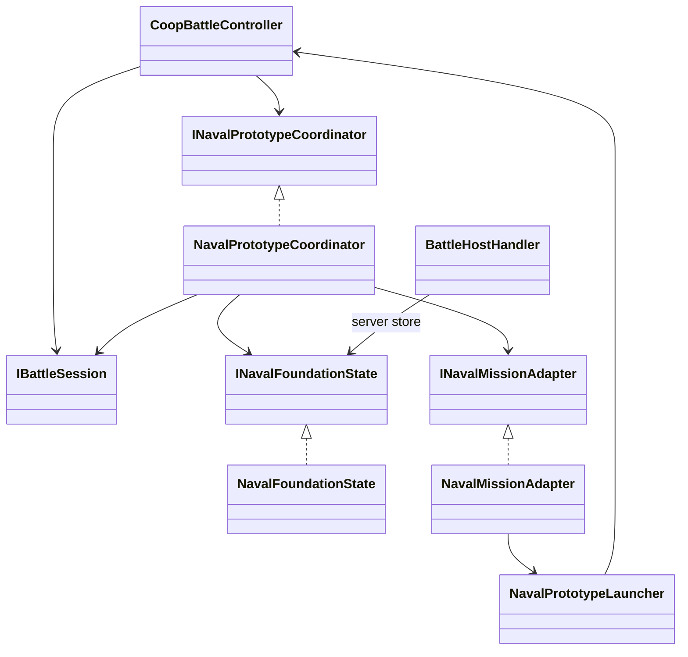
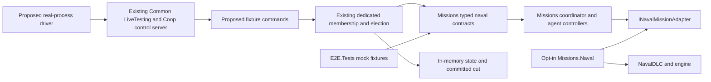

# War Sails battle foundation: stages 1 and 2

## Factory-authority diagnostic candidate

The parent-owned single-client run `2719563f90144c07bff5131fb1a9dd77` confirmed retained factory-active physics, deployment callbacks and rendered ship/native HUD. Intentional steering, orders, release and contact continuity remain unaccepted. The next explicit `FactoryAuthorityProbe` mode elects through empty scene readiness before either factory, then waits for separate complete hydration receipts. It preserves all three earlier modes and adds no native multiplayer captain/UI, admission, withdrawal or recovery policy. Its follower frame/contact path remains an experiment, not a supported physics seam. See [exact scope, instrumentation limits and bounded parent-only protocol](WarSailsFactoryAuthorityProbe.md). Independent review and explicit parent approval are required; `nativePass=false`, `deployApproved=false`.

## Single-ship native controls/deployment lab (2026-09-10, candidate)

The first live single-client run (`6689b1c996044739b87541368ad1e296`) reached ready/active anchored physics and returned a deployed receipt, then lost client responsiveness. The owned thread dump records `InvalidOperationException: Sequence contains no elements` in `TeamAIComponent.MakeDecision` / `Extensions.MaxBy`, during team ticking. Single-mode initialization omitted the stock tactic list. The correction supplies `TacticNavalBalancedOffense` on both teams and `TacticNavalLineDefense` on the defender. Their stock power query also requires a provider: single mode alone installs `NavalLabBattlePowerCalculationLogic`, summing actual fixture agents' `Character.GetPower()` by team, with zero power for the empty opposing team. This fixed, invulnerable population has no reserves or casualty accounting; it is not a general replacement for campaign spawn/power logic.

`NavalLabSingleClientTeamAITests` exercises production team initialization and actual managed decisions/stock tactics with five agent shells in a nonempty formation. It reproduces the missing-tactic exception and missing-power dependency separately, verifies team-power and no-enemy queries, and checks zero totals. Native creation, relation, scene and position boundaries are substituted, not the tactic/query bodies. The faulting team's heap fields were unavailable in the dump; its exact identity is not independently recovered. The precompletion water-only screenshot remains a separate visual gap, not fixed by this correction. No successful native input or postcompletion tick acceptance is claimed.

A new explicit `SingleClientNative` fixture is available through server command `coop.debug.naval_lab.create-single`. It admits **one connected client**, one `nord_medium_ship` and five inert `imperial_infantryman` actors: the client's synthetic main agent and four real native AI crew. The native formation captain is assigned separately from the helm pilot. This is not a real hero, AI-opponent battle, copied campaign fleet, full vanilla captain-picker, or completed stage 2. The dedicated campaign server still has no mission/playing party. Existing two-client `create ... activation` and `create ... held-helm` contracts, distinct owners and follower holds remain unchanged.

The new mode intentionally keeps the factory-created dynamic body active from creation, anchored during deployment. **Anchoring and input gating are not a rigid-body pause or readiness barrier.** No startup `DisableDynamicBodySimulation` or `EnableDynamicBody` is called in this mode. Native water/contact physics can run before readiness. Only after one-owner epoch-one readiness, matching registry authority, completed native views and explicit `complete-deployment` can normal keyboard/order controls run. Fault, departure, stop and disposal terminally hold the body; no resume or second fixture is supported. Guards remain installed until process exit. Old activation's failed disable/enable seam is unchanged, not fixed.

Composition uses the override-aware naval control and order factories from the native `NavalBattle` view definition, plus native troop placer, formation/ship target handlers, highlight, status, equipment and options/escape views. It does not invoke that named campaign opener or collect its campaign scoreboard, capture or order-of-battle views. `TeamAINavalComponent` supplies real naval order controllers and formation AI; an empty opposing team is present only for native query/placer dependencies. `NavalTrajectoryPlanningLogic` supplies native ship avoidance. No enemy hull, fake player, native contact suppression or synthetic boat movement was added.

Deployment mirrors the relevant installed `DeploymentMissionController.FinishDeployment` operations, **not full vanilla equivalence**:

- Before completion: preassigned `Formation.Captain` via `NavalAgentsLogic.AssignCaptainToShip`, formation `PlayerOwner`, native player order owner, active anchored hull and native Deployment mode. Native spawn sets `InitialPlayerAgent`; no campaign hero assignment.
- Retained: turn off ship teleport mode, `Mission.OnDeploymentFinished` (team AI then reverse behaviors, event), native AI alarm/unpause/enemy-cache/human-AI synchronization, initial player detachability/controller, AI ticking, fall-avoid switch and `Mission.OnAfterDeploymentFinished` (reverse behaviors then native per-agent stat/equipment model callbacks).
- Added fixture composition: native crew-detachment spawn placement only after ship-wide helm/oar/climbing/attachment lifecycle callbacks, end naval deployment modes, switch to Battle mode, enable native automatic ship-controller selection. Exactly one completion attempt can enter native work; failure holds and cannot retry. The native singleton must name this local ship or no ship, never another controller's ship.
- Deliberately omitted: defender unhide (there are no hidden enemies), stock controller/handler removal (neither is installed), campaign deployment planning/suppliers/hero picker, and stock `DisableDying=false` (lab mortality protection stays enabled). Native `MissionShip.OnDeploymentFinished` performs unanchoring and child callbacks; a flag assignment is not substituted.

Controls before completion or after lost owner authority are blocked at native main-agent input, ship axes, discrete naval input and order dispatch. Only the original main actor can use the fixture helm through Action. Unsupported target/retreat/transfer orders and boarding/weapons/cut-loose features are excluded. Available one-hull orders are Move, Stand Your Ground, Mount/defensive crew, AI on/off and fire-mode selection (unarmed crew). No enemy-dependent order is claimed; a single hull may make E focus/selection unavailable. No scripted helm/probe/walk/crew/take-helm commands are accepted in this mode. Use actual native keyboard and order UI, not command receipts, to test it.

### Parent-only manual protocol, after independent review and explicit deployment approval

Fresh isolated server plus one client, unchanged run-scoped opt-in, all normal memory/profile/modal checks. Query the live catalog and `coop.debug.players.list`; the worked identity is `testclient1` only if actually listed. Commands below run on the **server**, client commands are read-only inspect. UUIDs are single-use examples.

```text
coop.debug.naval_lab.create-single 5a6e1ecc-117b-41b5-8f8b-dd856d2814c9 testclient1
coop.debug.naval_lab.receipt 5a6e1ecc-117b-41b5-8f8b-dd856d2814c9
coop.debug.naval_lab.inspect
coop.debug.naval_lab.action a78a3691-8724-492c-b405-b0814fa17323 complete-deployment 0 0 false
coop.debug.naval_lab.receipt a78a3691-8724-492c-b405-b0814fa17323
coop.debug.naval_lab.inspect
```

Before completion require one ready owner/elected epoch 1, one finite initialized hull/five agents, real captain/main identity, no blocker, Deployment mode and input disabled. Inspect client `singleClientNative`: actual view types, movie/VM/category, deployment counters/state, captain, pilot, main actor, ship controller and singleton. If views are not ready, do not treat a receipt as completion. After completion require both callback counters 1, native deployed flag/Battle mode, unchanged invulnerability, input enabled and active native hull. Capture screenshots of deployment and actual native HUD after helm use.

After deployment, observe at least ten seconds of continuing client ticks and repeated read-only inspect before issuing any input; a deployed receipt proves synchronous return only. Require a usable deck/main-agent view rather than water-only imagery. If the view is still missing, retain the screenshot and read-only camera/view observations and stop manual input acceptance rather than forcing camera state.

On the client, approach the helm and press remapped Action (installed default F), then use actual A/D/W/S, Z sails, X oarsmen and C camera. Observe correct pilot/main/captain identity, singleton destination, oar station users and real sail/rowing response and force/pose changes. Press F to release; observe actual native point/agent cleanup and ordinary camera/walking. Select the ship via native formation/order controls when available, release helm before AI movement orders, and verify actual AI/ship response rather than the `nativeOrders` observation counter. `nativeOrders` counts native order notifications, not physical results. Do not claim E selection if no valid focus target exists. No autopilot/opponent target may be invented to complete the case.

Stop immediately on missing collaborators, body activation failure, unexpected campaign/damage/capture call, identity disagreement or native exception. Always end the disposable processes and restore installation/profile state through parent-owned cleanup:

```text
coop.debug.naval_lab.action e4dfe839-b9d5-4f74-b31d-01c3e204f4bb stop 0 0 false
coop.debug.naval_lab.receipt e4dfe839-b9d5-4f74-b31d-01c3e204f4bb
```

`outcomeUncertain` means query the same receipt, not a fresh mutation. Native use/release contradictions from earlier held runs remain unresolved. The corrected candidate has no native run: **nativePass=false, deployApproved=false**. Managed tests prove routing/gating and installed managed dispatch/patch bindings, not complete native deployment, visible HUD, crew station use, orders, motion or multiplayer follower support.


## Bounded L1 control and measurement increment (2026-09-07)

The owner now grants implementation/testing authority for playable stages 1/2. This increment is deliberately only the next synthetic native L1 probe; the parent owns deployment, exclusive runtime ownership, memory preflight and restoration. No game was launched or live module written by this task. Independent review is required before using the new frozen candidate. Stages 1/2 and native L1 acceptance remain incomplete.

Latest parent evidence `%TEMP%/warsails-live-20260907-modal/parent-runtime-report.md` records successful layer-selected **Call of the Oceans / Continue** activation from a complete 43-widget scope, then the cleared Danustica campaign view. It used one client after the server-plus-two-client memory preflight failed. It did not create a naval mission or test the scalar inspect repair, helm, contact or physics. No owned game or restoration remains outstanding. Do not bypass the two-client memory gate. Parent preparation is `%TEMP%/warsails-parent-next-runtime.md`.

### Implemented debug actions

Reuse `coop.debug.naval_lab.action operation_id kind ship rudder row`, server only. All controls require the same incarnation, elected epoch 1, both original owners in the ready host/successor assignment and the original connected controllers. Agent commands route to `manifest.Controllers[ship]`, never to the simulator as a fallback. The recipient also checks original/current registry authority, revision 1 and the exact manifest agent slot against the adapter agent. Receipts mean accepted dispatch, not physical success.

| Kind | Meaning and bounds |
|---|---|
| `helm` | Existing one-second elapsed-time deadman. Ship 0/1, finite rudder [-1,1], row boolean. Only elected client applies ship input. Rejected while a probe drives. |
| `probe` | Maximum 30-second local elapsed-time observation window and elected-host helm drive using the same arguments. Each recipient owns its own deadline; starts and clocks are not synchronized. One active window, eight cumulative windows per client, within the existing 64 ordinary-operation budget. Duplicate IDs never restart/extend a window. A later successful window replaces retained samples, so export before starting another. |
| `walk` | One-second native synthetic-captain pulse on the chosen original owner's ship. Rudder argument is signed forward movement input [-1,1], `row=false` required. Uses native walk mode, not support relocation. |
| `turn` | One-second synthetic-captain look/turn pulse. Rudder argument is signed radians/second [-1,1], `row=false` required. No ship/captain authority transfer. |
| `jump` | One bounded native jump-input edge on that synthetic captain; does not repeat the jump each frame. Both numeric argument 0 and `row=false` required. |
| `crew` | One-second native scripted AI target pulse for original crew slot 1, using that hull's enumerated local deck slot 5 (zero-based, outside the five initial spawn slots). Requires slot availability, initially unscripted AI, native nonzero target navmesh, argument 0 and `row=false`. This is **not** a formation order, a reserved/free slot, proven traversability, or safe evacuation capacity. |
| `stop` | Existing idempotent emergency teardown, both clients. |

Probe drive can coexist with owner pulses; only one agent pulse is active on a given client. Deadlines use monotonic process-local elapsed time, checked on mission callbacks, not accumulated simulation `dt` and not a final network stop packet. Hold, stop, fault, original-owner departure, epoch change, leaving and disposal cancel controls. A stalled process cannot execute cleanup until a callback runs and fails the runtime gate. Temporary movement input is restored only if it still matches the probe's last write; jump bits and owned AI scripted movement are released. Final turn orientation is not teleported back. A pulse can be accepted yet produce no movement; report the native result.

### Bounded paired observations, explicitly not a cut

`coop.debug.naval_lab.samples 0` is read-only on clients and returns up to eight retained records. Continue with the greatest returned `sequence` as the cursor. The dedicated server returns `unavailable:no_native_controller`, not an empty successful physics observation. A window retains 64 records, sampled on the host at no more than 2 Hz during the 30-second deadline. No whole-window JSON dump is necessary. Export both clients before another window or teardown.

Pair records by **incarnation, probe operation ID, epoch and source sequence**, never by poll time or matching callback numbers across processes. The frame message carries `SourceCallback`, the elected host controller's `OnMissionTick` ordinal. This is **not a native fixed tick**. `transmittedFrames` is the exact 24-float source target (two hulls, each side/forward/up/origin, XYZ). Host native observation is read separately in that callback; it is not asserted atomic with the frame read.

Follower records distinguish `receivedCallback` (local ordinal observed by the network callback), `appliedCallback` (local ordinal at queued game-thread application) and `observedCallback` (next mission callback before that callback's ordinary agent polling/interpolation). `native.observed` contains freshly read local ships/agents, not the transmitted targets. Observations contain native frame/velocity, force counters and aggregate committed crew mass, stored native controller rudder/row input (not actuator-force output), world position, look/input, exact-root fixture support and support-local position when that root is known. Missing root support yields null support-local position. `native.authorities` records actual registry controller/revision/movement identity, with explicit missing-identity errors.

If another frame is applied before the next mission callback, the old sampled target gets `superseded_before_next_mission_callback`, null native observation and null observed ordinal. Cancellation likewise preserves an unavailable row rather than inventing a cut. Adapter refusal returns `unavailable:frames_not_applied`, received identity but null applied/observed ordinals; an apply exception retains a failure row and is rethrown to the existing logged receive boundary. Received and applied sequence watermarks are separate. Inspect cumulative `receivedGaps`, `rejectedFrames`, `rejectedSamples`, `supersededSamples` and per-window `overwritten`; gaps are source-sequence gaps, **not proven transport loss**. Received/applied target agreement is not contact validation. The next local callback does not certify completed native parallel physics; do not label these records same-tick cuts, synchronized owner slices or recoverable snapshots.

### Exact next parent protocol

First pass aggregate memory preflight, deploy only the independently reviewed new six-DLL freeze plus unchanged opt-in, verify loaded MVIDs and clear each currently observed modal using the reviewed UI protocol. Use the server catalog and `coop.debug.players.list`; `testclient1` and `testclient2` below are the earlier observed identities and must match the new run. These fresh worked UUIDs are single-use examples; the parent must assign fresh UUIDs to each later run.

1. Server: `coop.debug.naval_lab.create 7cacdcc4-d847-499e-b733-c2e003580906 testclient1 testclient2`, then `.receipt 7cacdcc4-d847-499e-b733-c2e003580906`. Require two ready receipts, epoch 1 and no blocker. Inspect all processes; require two initialized finite hull rows and ten finite agent rows per client, matching manifest/registry identity and no damage/save/campaign fault.
2. Server: `coop.debug.naval_lab.action e2118d91-bc2b-4ee7-a5bd-9ab541d95490 helm 1 0.2 true`, then `.receipt e2118d91-bc2b-4ee7-a5bd-9ab541d95490`. Both clients only inspect. Prove a moving host, necessary host active/force deltas, zero follower active/force deltas and native neutralization after one second before proceeding. If absent/unavailable, stop rather than claiming a pass.
3. Server: `coop.debug.naval_lab.action 34078927-0acb-46a5-8c8b-d649d1f4b3de probe 1 0.2 true`, then `.receipt 34078927-0acb-46a5-8c8b-d649d1f4b3de`. Require accepted receipts on both clients. Continuously export `.samples 0` then subsequent cursors from each client during the window; no client state-changing command is permitted.
4. During this moving window, issue the following server-only pulses and query each same operation receipt before continuing. Do not overlap pulses on the same client; wait for its read-only inspect `agentControl=inactive` between pulses. Input deadlines, not runner sleep, end the actions.

```text
coop.debug.naval_lab.action 1cf649f2-646d-4f8f-8c2b-a15985fb4914 walk 0 0.25 false
coop.debug.naval_lab.action e83f3865-ec39-48fd-8c1e-f61afcf98129 walk 1 0.25 false
coop.debug.naval_lab.action a6344169-138b-4614-8e59-62651fa11c1d turn 0 0.25 false
coop.debug.naval_lab.action 452ed1ac-1011-443e-90a4-e50d14f357b0 turn 1 -0.25 false
coop.debug.naval_lab.action 2cbbd916-4f10-4331-aaef-263f6b2e0a09 jump 0 0 false
coop.debug.naval_lab.action 8b7d0ae0-5f75-48ab-ae29-84f4a0e90b0e jump 1 0 false
coop.debug.naval_lab.action d6cfc47a-c4a2-448b-8789-79196bf615d3 crew 0 0 false
coop.debug.naval_lab.action 871a34e3-28aa-4c28-8c1e-8fc8edc5ce47 crew 1 0 false
```

5. Observe both window statuses become `expired`, native agent controls inactive and helm neutral after the 30-second local deadline. Export remaining pages and final inspect. If dispatch/receipt latency prevents finishing the pulse series during the window, the case is incomplete; do not extend it by replaying the same operation. Repeat a new reviewed window only after exporting the old one and staying within cumulative budgets.
6. Server teardown: `coop.debug.naval_lab.action 3e10b523-e822-4c62-89fa-fe5a7b8a9ec0 stop 0 0 false`, then `.receipt 3e10b523-e822-4c62-89fa-fe5a7b8a9ec0`. Use existing parent-owned shutdown/restoration even on failure. `outcomeUncertain` requires the same-ID receipt, never blind new-ID retries.

Acceptance limits remain honest: no error/unavailable row may count as a successful contact sample; no follower active/force increment; preserve individual/controller identities and HP; record actual walking/turn/jump/AI movement and unexpected support loss. Sampling at 2 Hz cannot prove the absence of between-sample contact loss or penetration. Existing proposed 0.25 m / 2 degree hull p95 and 0.20 m supported-agent same-timeline budgets **cannot be certified by this asynchronous instrument**. Report source-target tracking errors with source/apply/observation age separately, maxima and missing/overwritten counts, without relabeling them same-tick errors. Aggregate crew mass is not remote-controller force attribution. Actual hero identity, native formation orders, captain helm UI/grants, support-local transport and direct/relay route proof remain outside this increment.

### Native evidence, validation and next completion order

Regenerated installed owners are under `%TEMP%/warsails-l1-measurement/candidate-20260907-102947/native/`: `Agent.cs`, `Mission.cs`, `MissionMainAgentController.cs`, `WorldPosition.cs`, `PlayerShipController.cs`, `ShipInputRecord.cs`. `Agent.MovementInputVector`, `EventControlFlags`, `LookDirectionAsAngle`, `SetScriptedPosition` and `DisableScriptedMovement` directly bind native APIs. `Agent.cs:2426-2432` explicitly calls `TeleportToPosition` when `Mission.IsTeleportingAgents` is true. The adapter rejects that mode at crew admission **and checks it again before every scripted-position call**. `WorldPosition` navmesh query and native enumeration do not establish free deck clearance. `Mission.cs:3741-3775` calls mission behaviors before the subsequent agent tick; `OnPreTick`'s `WaitTickCompletion` is not used here as a new physics barrier. `MissionMainAgentController` collects its normal input on `OnPreMissionTick`; the fixture writes its bounded native input at the later mission callback. No physics/contact tick or water force was removed.

Compile-only Debug Coop, adapter and Coop.Tests plus Release Coop.Core pass with installed VS18, `/p:ModName= /p:PostBuildEvent= /nr:false /m:1`. Naval tests pass 62/62 (21 added cases), and selected land regressions 22/22. They cover deadlines/duplicates, stale identity/epoch/owner, finite scalar codec/observation data, bounded windows/pages/overwrite reporting, hold/disposal/invalid-handle cleanup and honest unavailable rows. No test constructs collidable native hulls or proves runtime locomotion/contact. Artifact freeze includes starting inventory/hashes, task-only before/after diff including previously untracked files, native evidence, six managed hashes/MVIDs and unchanged opt-in. Earlier frozen copies are untouched.

Remaining completion checklist, native feasibility first:

1. Independent review, then memory-gated two-client startup and repaired native inspection. Run the bounded moving-hull/owner-pulse instrument; diagnose real follower contact before more protocol code.
2. Prove actual player-hero control, native troop orders, remote crew force attribution and support-local motion/timeline. Add native contact evidence sufficient for agreed error budgets, not a fake parallel cut.
3. Decompile and prove bridge attach/retract, traversable support and unoccupied runtime hull retirement. Then implement bounded arrival and occupied evacuation only on proven placement/detach seams.
4. Prove safe native parallel hold and resumable actuator/water/constraint state; only then implement acknowledged snapshot and elected-host recovery. No recovery claim from frame-only follower state.
5. Complete missing stage-1 admission/withdrawal/receipt tests and stage-2 L2-L9, direct/forced-relay and isolation/cleanup matrix. Keep production naval entry denied and campaign casualty/save integration deferred as specified below.


## Successful native startup and inspect repair (2026-09-07)

Parent-owned run `c61b964a0b0644b58fb7bfe636b06ece` reached campaign readiness on server 35676 and clients 35096/36464, then mission readiness on both clients. Create operation `5413fe62-9902-4bf9-a576-e37a85d00b04` produced incarnation `1b768ccde73c4f93a568dca4f5048b71`. Both client logs identify adapter MVID `d84dd791-80b8-448b-b337-97b6e951c328`, profile initialization before the factory, `factory_complete:0`, `factory_complete:1` and `fixture_initialized`. First-ready election chose `testclient1`, epoch 1, with `testclient2` successor. Movement observations report ten agents, five local agents and two controllers. The SailWindProfile repair has native startup evidence, not an L1 physics pass.

Both `coop.debug.naval_lab.inspect` commands failed with `InvalidCastException` in `MatrixFrame.Equals(object)`, reached from Newtonsoft's circular-reference check. The installed method directly casts its object argument to `MatrixFrame`. Diagnostics now copy every frame/vector to scalar-only data records, without changing JSON settings or engine equality. Every allocated ship/agent slot remains in inspection; unavailable native handles, incomplete ships and caught managed read failures report an `error` and null measurements instead of disappearing or supplying zero poses. Non-finite physical values reject that row. `expectedShipCount`/`expectedAgentCount` make partial initialization visible. Inspection remains read-only and does not release or repair physics.

The native scene script query still returned `sceneShips: []` after initialized factories in this run. Its managed wrapper passes the script type name to the engine; the reason for the empty native result is not established. Startup reports now retain that query separately and add `registeredShips` from mission objects and `fixtureShips` from returned factory slots, including script type, entity pointer, registration and initialization flags. These are different inventories, not proof of complete scene enumeration or safe partial-body teardown.

### Modal staging before the next fixture

Both preserved screenshots show a rendered drakkar deck, a bare-backed synthetic captain and **Call of the Oceans** with **Continue**. Neither screenshot proves movement, contact or absence of an overlay. Fresh decompilation of `NavalInitializationCampaignBehavior.OnCharacterCreationIsOver` confirms this exact inquiry has null accept/cancel/timeout callbacks. The event itself adds six focus points immediately after displaying it; dismissing the inquiry does not invoke that event again. Do not call the event or add `DefaultNavalMissionLogic` as a UI repair. The separate **Troubled Waters** inquiry is not equivalent: accept starts the storyline and teleports the main party; decline still starts the storyline.

On the next approved, isolated parent-owned run, finish campaign readiness and use existing owned MCP UI inspection on each client **before create**. Only if the current tree exposes the visible, enabled, interactable **Continue** belonging to **Call of the Oceans**, use its current snapshot/element reference for the existing click action. Immediately inspect again and capture the cleared view. No cached coordinates, unseen auto-click, campaign event invocation, DLC-wide behavior suppression or generic UI tooling is authorized. If no actual target is exposed, or the title differs, stop staging and report it. This repair adds no modal patch because the observed inquiry's null callback permits this narrower staging recommendation. Save/profile/opt-in isolation remains mandatory.

### Exact next diagnostic commands and interpretation

These are future commands for the parent, not commands run by this implementation task. Confirm the catalog and `coop.debug.players.list` on the server first. The observed controller IDs were `testclient1`/`testclient2`; use them only if the next run lists those actual identities. With both client modals visibly cleared, use the following fresh operation IDs once in that run:

```text
coop.debug.naval_lab.create 8dd7a4ec-2c47-4d45-9823-d9a9a60d6eea testclient1 testclient2
coop.debug.naval_lab.receipt 8dd7a4ec-2c47-4d45-9823-d9a9a60d6eea
coop.debug.naval_lab.inspect
```

Inspect all three processes; the server has no native adapter/mission. Require both ready receipts, elected epoch 1, no failure/blocker, two error-free native ship rows and ten error-free agent rows on each client, finite scalar measurements and initialized factory inventory. `frame` contains `origin`, `side`, `forward`, `up`, each with `x/y/z`. Record baseline counters on both clients before any helm. Only after valid inspection and a reviewed baseline, the server may issue this one-second ship-1 rudder/oar pulse and inspect its receipt:

```text
coop.debug.naval_lab.action 6f989ae8-29fa-4bc8-a3b6-7eb8efbd7c51 helm 1 0.5 true
coop.debug.naval_lab.receipt 6f989ae8-29fa-4bc8-a3b6-7eb8efbd7c51
coop.debug.naval_lab.inspect
```

Inspect both clients over time and after the one-second deadman; an `applied` action receipt is dispatch evidence, not evidence of thrust, remote captain permission or successful contact. The server command does not exercise actual hero helm UI. If first-ready election reverses, read the host record rather than assuming client 1 is the simulator. Preserve new logs and snapshots, and stop on unsupported native body/contact behavior, invalid diagnostics or a damage/campaign-write blocker. Do not substitute independent follower integration, input lockstep or still-frame agreement for physical support.

Counter meanings are unchanged: `fixedTicks` counts patched `NavalPhysics.OnFixedTick` entries for the two fixture hulls, including inactive ones; `activeFixedTicks` counts entries whose body reports active simulation; `forceApplications` counts entry to `ApplyForceToDynamicBody`, not force magnitude or every native force/torque method. These are cumulative per-client, aggregate counters; compare deltas, not totals from differently timed startups. They do not instrument all parallel buoyancy/drag computation or prove a native solver integration barrier. A follower must not acquire active/force deltas in this probe, while host deltas and actual movement must be observed, but that alone is insufficient for L1 acceptance.

`crewMass` and `crewWeightedPosition` are the native committed aggregate mass and mass-weighted world-position sum, not a centroid or per-controller force attribution. The native agent-force path divides the sum by mass and checks the local bounding box before applying weight; nonzero committed mass alone does not prove remote crew force contribution. `steppedValid` reports a nonzero stepped-root handle; `steppedFixtureSlot` is an exact root-entity match to a returned hull (otherwise -1), not bridge support or a traversable/contact guarantee. `navmesh` is a process-local native handle, not a shared ID. Positions/counters are sampled during command execution, not a synchronized held cut, so asynchronous inspect polls cannot supply same-tick error budgets or recovery snapshots.

On failure or completion, server teardown remains:

```text
coop.debug.naval_lab.action 0e188dd0-dc72-44c7-a80b-99f01a8d4782 stop 0 0 false
coop.debug.naval_lab.receipt 0e188dd0-dc72-44c7-a80b-99f01a8d4782
```

For any `outcomeUncertain`, query that operation's receipt instead of blindly issuing a new ID. In the completed startup run, parent stop `ce15bc99-e3da-45af-83de-fd4a3a829611` received both applied receipts; owned MCP cleanup records all three process trees stopped with `cleanupComplete`. Canonical/profile/opt-in restoration and save differences `{}` were recorded. No live run remains owned, and no helm was issued after the broken inspect.

Validation for this repair: six compile-only builds passed with zero errors (Debug Coop, adapter, Coop.Tests, GameInterface.Tests and bridge tests; Release Coop.Core), using installed VS18 and `/p:ModName= /p:PostBuildEvent= /nr:false /m:1`. 192 regressions passed: 94 Coop, 90 GameInterface, 8 dispatcher. Seven added test cases cover an initialized-shaped two-hull/ten-agent inspect command using real managed frames/vectors, scalar fields/counts, NaN/infinity rejection, error rows, null/zero agent handles and partial fixture counts. These tests do not construct native ships; a real invalidated ship handle and the new registered/factory inventories still require native review. Independent review of the distinct inspect-fix freeze is required before the next parent-owned measurement run. No deploy, launch, installation, commit, push or main-checkout changes were performed here.

Stage 1/2 are still incomplete. Actual player-hero captains, support-local motion, remote crew force attribution, walking/jumping/AI orders on moving follower decks, captain grants/revocation, boarding/constraints, bounded admission, occupied withdrawal, acknowledged snapshots, migration and direct/forced-relay physical acceptance remain outstanding. Production naval entry stays denied; synthetic origins, default-off run-scoped opt-in and save/campaign guards are unchanged. Stop at a native unsupported gate rather than claiming a physics pass.

## Sail initialization repair candidate (2026-09-07)

Run `95e059a6161440b6a1a26bdbe22f56ac` reached campaign readiness on server 36188 and clients 43628/37344. Both configured client logs captured the first exception in `MissionSail.FixedTickTargetSailRotation`, called while the first hull loads its sails. The opening marker identifies Missions MVID `1a81c159-3e44-4260-b865-514aabe4a070` and adapter MVID `cf803cc6-8bae-4ee7-9189-29b5e04f999d`. Empty diagnostic `sceneShips` arrays do not prove that failed factory creation left no native scripts.

Installed DLL decompilation identifies the missing lifecycle: `FixedTickTargetSailRotation` reads `SailWindProfile.Instance`; the sail definition has already been dereferenced in `InitWithVariables` before that call. `DefaultNavalMissionLogic.OnBehaviorInitialize` normally initializes the profile, and `OnMissionStateFinalized` releases it. The synthetic lab omits that campaign/deployment behavior. `Mission.AfterStart` runs every behavior's `OnBehaviorInitialize` before any `AfterStart`, where the lab creates its hulls. `NavalLabBehavior` now supplies only this native profile lifecycle at the same callbacks. `BattleInitializationModel.InitializeModel` only updates deployment-cache and initialization flags; it is not the sail profile initializer and is not added here.

Startup inventories now include `sailWindProfileInitialized`, including the enumeration-failure snapshot. Three managed regressions exercise the real installed sail profile before any hull creation, reuse through mission end and release at mission-state finalization, and diagnostic reporting when scene enumeration is unavailable. The DEBUG-only test project reference/publicizer exposes the optional adapter to these tests, not to normal runtime consumers. These checks do not run the native ship factory or demonstrate playable captains, water integration, moving follower contact, or L1.

The fix does not suppress sails or ticks, add campaign behaviors, alter water/wind, delete partial bodies, or change the synthetic origins, authority, opt-in/save guards or normal naval denial. Independent review of the distinct frozen sail-fix candidate is required before a parent-owned native initialization diagnostic. Both hulls and all ten crew must actually initialize on both clients without a new exception; preserve the per-client startup logs and inspect the profile flag and factory phases. Stop on another initialization failure rather than treating test success as native success.

## Diagnostic visibility correction (2026-09-07)

Run `5af6c888183d4a909c0cc4346f6768db` again crashed both clients in `MissionShip.OnTickParallel`, with no `[NavalLabStartup]` entries. The diagnostic owners incorrectly used `Serilog.Log.ForContext`; Coop configures the separate `Common.Logging.LogManager` logger and never assigns `Serilog.Log.Logger`. Both owners now use the configured logger. A synchronous `open begin` entry records the incarnation and loaded Missions/adapter MVIDs before controller startup enters the native mission.

This reuses the existing process-specific, bounded file sink, which writes and flushes each event; no global logger replacement or extra sink is introduced. The parent must preserve both client logs before restarting. A regression observes the configured output callback before native entry and verifies the original exception/stack arrives before rollback. Dump module records match the staged candidate's image metadata, but the thread dumps omit the managed metadata pages, so an exact loaded MVID cannot be independently recovered from those dumps. The original native initialization failure remains unknown. No physics or teardown change is justified by this visibility finding; review the distinct frozen candidate before another parent-owned diagnostic run.

## Native startup diagnostic checkpoint (2026-09-07)

Parent run `bdc01923e9454a47b01892416098e100` passed fresh campaign startup and both client transfers. Both clients then crashed before naval readiness. Dump IP/IL evidence proves null `MissionShip._actuators` in `OnTickParallel`; the first factory creation appears in both rgl logs, but the earlier construction failure is not present in the thread-only dumps. No helm/contact test ran.

The approved follow-up is diagnostic-only, not a native startup repair. It logs the original construction exception/stack before rollback, records factory and `InitForMission` phases, and inventories actual scene `MissionShip` entities (including partial/unassigned objects) instead of assuming only the two returned hulls exist. Failure receipts retain the stack; cached startup inspection survives adapter disposal. Incomplete hull/crew initialization cannot announce readiness.

No tick suppression, body deletion, or new physics hold was added: native script registration precedes `InitForMission`, and safely retiring every partially initialized child across parallel ticks has not been demonstrated. The next bounded parent-owned run may still crash, but should preserve the earlier exception in `[NavalLabStartup]` log entries. Stop after that evidence and fix the proven dependency before helm/contact testing. Existing lab/save isolation and teardown guards remain; initialized ships retain real native water, crew and contact callbacks. Independent review is required before that run.

## Current implementation checkpoint (2026-09-06)

The implementation worktree is based on PR3536 (`01b429fe04211f65585e2ab615ac224f47969581`), not the earlier design baseline below. The user subsequently authorized implementation and parent-owned live testing. The detailed stages below remain the acceptance contract, not completed features.

Implemented so far: DEBUG `NavalLab` fixture manifest/store/commands, existing-client-host election route, mission-local inert origins, optional `Missions.Naval` adapter, two native hulls and ten synthetic crew/captains, host frame publication and candidate follower body updates. Tagged casualty/result guards and native damage-failure holds protect the initial probe. The adapter retains damage patches through native teardown. Normal campaign naval entry remains denied.

The probe is deliberately incomplete: the captain is not yet the actual player hero; there is no bridge/admission/withdrawal/recovery protocol, support-local motion or synchronized water snapshot. Epochs beyond one hold shared physics rather than recover. `DisableDynamicBodySimulation` and `SetGlobalFrame` are candidate native seams, not demonstrated collidable follower support. No real-client physics pass has been recorded. The first two parent-owned server diagnostics crashed before campaign readiness, with no fixture opened. Dump evidence names `NavalDLCManager.OnGameStart` on the saved-campaign path, which retrieves `StormManager` before calling `OnAfterLoad`; missing saved DLC state is the diagnostic hypothesis. The fresh-campaign diagnostic below is not a vanilla-manager repair or permission to force-load an old save with DLC.

Executable catalog: `coop.debug.naval_lab.create`, `.action`, `.inspect`, `.receipt`. Discover actual connected controller IDs with `coop.debug.players.list`. Create takes an operation UUID and two distinct controller IDs. Action takes operation UUID, `helm` or `stop`, ship index (0/1), finite rudder (-1..1), and row boolean. Helm has a one-second deadman; stop ends the fixture on both clients. Inspect is read-only on every process. The initial probe permits one incarnation and 64 ordinary cumulative operations per process, plus separate idempotent emergency slots for one hold and one stop. Repeated stop requests return the original stop receipt. Scene `battle_terrain_opensea_northern`, hull `nord_medium_ship` (`ship_drakkar` prefab), character `imperial_infantryman`, five actual enumerated inner-deck frames per hull. Native module prerequisite order on clients is Native, SandBoxCore, Sandbox, StoryMode, NavalDLC, Coop. The dedicated server never loads the optional adapter.

The MCP bridge prerequisite was integrated from PR3540 (`5192afea`): actual bounded UI inspection/actions, metadata and structured command outcomes, with the existing PR3536 capture/deadline/manual-join behavior retained. It is not a marker-only compatibility bypass. Validation at this checkpoint: 14 naval protocol/isolation tests, 36 existing land session/completion/deployment/result tests, 57 UI adapter/snapshot tests, and 8 dispatcher tests pass. Compile-only Debug Coop and adapter builds pass. These tests do not prove native naval physics or complete isolation across an actual engine run.

For compile-only builds on this revision, `/p:ModName=` is mandatory: `Deploy.targets` ignores `DeployOnBuild`, and clearing `PostBuildEvent` alone does not suppress deployment. Never deploy game/publicized dependencies from either output directory; the optional adapter contribution is only `Missions.Naval.dll`.

## Scoped fresh-campaign diagnostic and L1 review fixes

The four L1 prerequisites now have regression coverage: the lab movement handler excludes its synthetic crew from location-style delayed peer cleanup without setting `BattleSpawnGate`; adapter preflight precedes controller/mesh/membership mutation, with subscription and network rollback on start failure; emergency hold/stop allocation cannot exhaust the ordinary budget; and only matching DEBUG lab capabilities exempt NavalDLC from ordinary DLC rejection. Both production naval mission admission denials remain unchanged.

Default is off. For a parent-owned diagnostic, place `naval-lab.optin` **beside the installed `Coop.dll`**, containing exactly this worked example (a trailing newline is accepted):

```text
new-campaign:571cda18-4f3b-4787-9ac0-5997f17f083e
```

The parent must choose a fresh nonce for a real run and back up/restore any previous marker. Every participating process requires the same nonce, a valid `/cooptestrun` token from the existing MCP runner, and active NavalDLC. The nonce and runner token are both included in a synthetic module capability. Missing/different capabilities, DLC absence, other DLC, and module/game version mismatches still reject. `/cooptestrun` alone changes nothing. A malformed existing marker fails startup rather than silently loading `MP`. This is process-lifetime configuration, so changing/removing the file requires restarting all run-owned processes.

Only `InitialServerState` takes the fresh `StartNewGame` path instead of DEBUG `LoadGame("MP")`. Client validation, character creation and server-save transfer retain their existing lifecycle. `CampaignReady` still removes the server's main party before registration; no server mission or playable server party is introduced. MCP status exposes `navalLabCapability` to verify the captured scope.

Opted-in processes disable queued saves/autosaves at `SaveHandler.SetSaveArgs`. The `Game.Save` boundary denies non-`CoopInMemSaveDriver` saves with a warning and a real failure callback, rather than reporting success for a nonexistent disk file. This protects `MP`, `default_new_game`, existing autosaves and arbitrary explicit disk names. Transfer saves retain their existing in-memory driver and vanilla completion path. Co-op session data is still refreshed for transfer, but `CoopSaveManager` never writes a lab sidecar. If the native startup requires a successful disk save, this diagnostic must fail visibly; no fallback to disk or speculative manager conversion is permitted.

Inspected native owners for this diagnostic: `NavalDLCManager.OnGameStart`, `SandBoxGameManager.OnLoadFinished`, `CharacterCreationState.FinalizeCharacterCreationState`, `Campaign.OnInitialize`, `SaveHandler.SetSaveArgs`/save queue, `MBSaveLoad.SaveAsCurrentGame`, `Game.Save`/`SaveAux`, and `SandBoxSaveManager.OnSaveOver`. Startup completion and client transfer still require real engine evidence. This revision does not establish moving follower collision, actual hero identity, boarding, arrivals, occupied withdrawal, recovery, or a direct/relay pass.

## Decision and scope

Design baseline: local `development` commit `72378d6145ac609d93af3da2659233f573694452`, worktree branch `feature/warsails-battle-foundation`. This document replaces implementation-order stages 1 and 2 of the earlier full naval proposal. The owner has since authorized implementation/testing; the current bounded increment and parent-owned runtime gates above govern execution. This design is not a claim that the physics prototype works.

Required eventual behavior:

- The existing elected **client battle host** simulates shared ships. The dedicated campaign server elects and records authority; it has no playing party, hero or mission simulation.
- Preserve existing hero control, troop commands and per-agent authorities. A remote captain sends ship inputs to the elected host; captain permission is not physics authority.
- Parties join an ongoing battle with additional ships and troops.
- Retreat and campaign-server disconnect remove that participant's troops wherever they are, and their boats after other occupants have safely evacuated. Recover shared authority first when necessary.

These stages prove the smallest reusable identities/transactions and the engine feasibility of that behavior. They do not implement the complete campaign battle. Keep normal naval entry denied throughout both stages.

**Chosen simplification:** an explicit, damage-disabled, mission-local fixture; in-memory transaction records; one committed, acknowledged snapshot with no event replay ledger. Do not build durable event sourcing, save receipts, all naval combat or rewrite all existing casualty reporting before the physics spike. This is safe only if the fixture cannot mutate campaign ships, troop rosters or results. Prototype recovery is not campaign casualty-safe production recovery.

Capture-based boat withdrawal and protected off-scene survivor reserve are **not approved rules**. Capture is absent in the prototype, so admission provenance unambiguously identifies its boats. With no safe evacuation slot the prototype holds/rejects removal and reports the blocker. That test restriction is not the eventual gameplay policy.

`doc/BattleRequirements.md` BR-031 currently specifies adopting disconnected troops; the requested eventual naval withdrawal is an explicit naval behavior change requiring a scoped requirements update before production, not permission to change land behavior. BR-017 destroys an empty instance and retains its map event. Do not import the earlier draft's persistent hostless mission/reserve policy into these stages.

## Evidence checked on this base

Repository paths below are relative to the root. Line numbers refer to this base, not the old dirty feature checkout.

| Evidence | Consequence |
|---|---|
| `source/Missions/Battles/BattleHostHandler.cs:245-249,795-799`; `BattleSession.cs:15-38,68-81` | Reuse first-mission-ready election and epoch increments. `InstanceId` is the map-event ID; add a separate incarnation, not another election. Epoch zero is insufficient naval readiness. |
| `source/Missions/Battles/CoopFieldBattleLauncher.cs:100-163`; `CoopBattleController.cs:120-184,251-289` | Existing agent subservices remain composition-owned by the controller. Field launcher and end query are land-specific. Shared siege authority is precedent, not a ship physics solution. |
| `source/Missions/Battles/BattleAuthorityMigrator.cs:111-124,307-325` | Graceful withdrawal and disconnect adoption differ today. Naval fixture departure must bypass own-party adoption, without changing land adoption tests. |
| `source/Missions/Battles/AgentDeathReporter.cs:137`; `BattleCasualtyHandler.cs:60-110` | Current casualty request matches the next live troop of a character; replay is not idempotent. Descriptor seeds can be regenerated. Existing protocol cannot back production snapshot recovery. |
| `source/Coop.Core/Server/Services/Instances/Handlers/ServerBattleCompletionHandler.cs:97-137,150-162,196-218` | Membership/election notifications can reconcile results immediately. Fixture result reporting must be disabled, not merely delayed on the renderer. Future production transactions must participate in this barrier. |
| `source/GameInterface/Services/MapEvents/Handlers/BattleMissionStartHandler.cs:160-165,727-731` | Preserve both naval-denial paths; a separate DEBUG fixture route is not general naval admission. |
| `source/Missions/Agents/Packets/MovementPacket.cs:14-24`; `AgentData.cs:172-189` | Movement is unreliable and world-space. Reliable hull creation does not order an arriving agent movement datagram. |
| `source/Missions/MissionModule.cs:113-139`; `source/Coop.Core/Server/ServerModule.cs:54-58` | Module already composes the mission stack on server and client; engine/mesh services remain lazy on server. Do not instantiate a naval engine adapter there. |

### Installed engine evidence, not a supported co-op API claim

Owning DLL is `mb2/Modules/NavalDLC/bin/Win64_Shipping_Client/NavalDLC.dll`. Freshly decompiled `NavalDLC.Missions.MissionLogics.NavalShipsLogic` and `NavalDLC.Missions.NavalPhysics.NavalPhysics` for this revision. Scratch evidence is in `%TEMP%/warsails-battle/FoundationNavalShipsLogic.cs` and `FoundationNavalPhysics.cs`; companion decompilations below are in that same scratch directory. Use owning type and method when regenerating evidence; scratch is not a build dependency.

- `NavalShipsLogic.RemoveShip(MissionShip)` resolves the assignment. `RemoveShipAux` (fresh lines 1207-1248) clears assignment/formation and notifies subscribers; outside deployment it calls `Scene.RemoveEntity`. It does **not** establish safe evacuation. In deployment it instead hides/pools the hull. Test runtime removal, not just deployment pooling.
- `NavalShipsLogic.TeleportShipAux` (1250-1286) sets global frame, calls `UpdateAttachedNavigationMeshFaces`, and resets formation positioning. Its free-area branch changes the target only if the search succeeds; this is not a safe-placement success contract. Never call it with `checkFreeArea` and infer that an occupied target was rejected. Neither this nor native `SynchedMissionObject.SetGlobalFrameSynched` proves continuous follower collision/contact. The latter has native `GameNetwork` role gates, not co-op transport.
- `NavalPhysics.OnParallelFixedTick` (570-617) computes buoyancy, drag and drift under an active dynamic-body check. `OnFixedTick` (619-636) applies gravity, crew, actuator and anchor forces. `OnTickParallel` (1309-1315) commits crew mass/weighted position; `ApplyAgentForces` (1328-1357) uses it. `WaterDriftForceData` (136-156) includes a timer and random generator. A transform/HP snapshot is not a demonstrated resumable state.
- `NavalDLC.MissionShipFactory.CreateMissionShip` (`MissionShipFactory.cs:18-38`) prunes upgrade children and uses a shifted `uint` bit identifier. Network IDs must not use it. More than 32 cumulative factory allocations and any reuse policy remain a production gate, even if only two hulls are active.
- `NavalDLC.Missions.ShipControl.PlayerShipController.SetInput(in ShipInputRecord)` (`PlayerShipController.cs:16-23`) stores input returned by `Update`. This is a verified input seam, not proof that remote captain UI/controller ownership works.
- `NavalDLC.Missions.AgentNavalComponent.GetSteppedCombinedShipIsland` (`AgentNavalComponent.cs:163-176`) includes bridge support. The combined island is not an individual ship/bridge network identity. `SetCanDrown` and `SetCanBurn` exist (133-140); these alone do not suppress every injury source.
- `NavalDLC.Missions.Objects.UsableMachines.ShipAttachmentMachine` updates bridge navmesh frames (`ShipAttachmentMachine.cs:3034`) and bridge physics visibility (`:4542-4546`). Replicating hull visuals alone does not reproduce its constraint/attachment state.
- `NavalDLC.Missions.NavalMissions.OpenNavalBattleMission` (`NavalMissions.cs:178-232`) builds from player campaign fleets and installs naval agents, water, spawning, deployment, collision and end behaviors. Do not invoke this SP entry unchanged on either the server or every client. `NavalBattleEndLogic.OnMissionEnd` writes campaign captured-ship state (`NavalBattleEndLogic.cs:259-331`).

Before binding stage 2, decompile the exact frame/body mode, bridge connect/retract, agent detach/teleport and parallel-tick barrier owners. The methods above are useful investigation entry points, **not** a discovered follower-mode, atomic snapshot or evacuation API. Use publicized direct bindings for confirmed members; add explicit NavalDLC references/publicizer only in the opt-in adapter, not reflection over already-publicized types.

## Stage 1: smallest identity and transaction foundation

### Stable records

All IDs are opaque server-issued values, never display names, native object indexes, troop descriptor seeds or a transport peer object. Use existing registry party/character IDs at the campaign boundary later.

| Record | Minimum contents and lifetime |
|---|---|
| Battle | Existing instance ID plus fresh `IncarnationId`, protocol/content fingerprint, phase and current elected epoch. New incarnation on a new fixture/mission run even if instance ID is reused. |
| Admission | `AdmissionId`, immutable participant/party identity, current controller binding, side, status, granted ship/combatant IDs. Controller reconnect cannot clear an old admission's withdrawal receipt. |
| Ship | `ShipId`, generation, immutable admission provenance, hull/content definition, child-slot manifest fingerprint. Future campaign ship ID/version is an explicit boundary field, absent for synthetic fixture origins. |
| Child/bridge | Child key `(ShipId, generation, schema slot)` only for addressed controller/deck/attachment components. Bridge ID/generation and both endpoint child keys. No universal destructible/weapon catalog yet. Validate the post-upgrade schema on every peer. |
| Combatant | `CombatantId` allocated once per admitted individual, party/character or hero identity, admission, current agent GUID/generation and accepted agent authority revision. Rebuilding descriptors or replacing an agent does not mint a new individual. No withdrawal lookup by current controller or deck. |
| Operation | `OperationId`, incarnation, expected state revision, kind, admission, deadline, status and terminal receipt. Repeated ID with identical contents returns its receipt; conflicting contents reject. Retain terminal receipts/tombstones for the incarnation. |

Maintain separate elected ship epoch, per-agent authority revision, and captain grant revision. Captain input is `(ship, generation, epoch, grant revision, input sequence)`; revoke immediately on departure and neutralize stale input. Do not transfer shared physics to a captain.

### Ordered application and readiness

One server-authorized reliable state revision serializes topology, admission and withdrawal commits. Continuous hull pose is host-authored. The server validates operation identity, current epoch and preconditions, not ship physics. No arbitrary event-log engine is needed.

- Messages carry incarnation, epoch, required manifest/state revision and target generations. Snapshot ID is separate. Reject stale incarnation/epoch/generation; hold future-epoch traffic until the existing host assignment arrives, with a bounded expiry. Never treat epoch zero as permission to run naval physics.
- Apply all dependent receives through the same `GameThread.RunSafe` queue. Resolve registry IDs and Campaign state **inside** that action. A queued create is not yet a ready hull.
- Build in order: manifest, hull/children, bridge graph, ship state, agents and support-local poses, machine users, tombstones, ready receipt. Apply tombstones before activation; removed identities cannot be resurrected by late spawns.
- Agent motion gains `World/Ship/Bridge` support, support generation/contact revision, support-local pose/locomotion velocity, source ship tick and required state revision. Preserve existing agent controller/revision checks. Hull and bridge frames precede agent presentation at the same sampled timeline; locomotion speed excludes deck transport. Evacuation increments contact revision and resets interpolation.
- A movement sample whose dependency is missing never applies. Keep only the latest sample per bounded, known identity; drop stale samples and request a full state on a reliable gap. No unlimited unknown-ID queues. Prototype proposal: 256 known movement slots, 64 pending control messages, 1 MiB encoded snapshot, 10-second hydration expiry. These are initial lab limits, not measured engine/network capacities; oversized fixtures reject explicitly.

### Bounded admission and withdrawal

Admission states: `WaitingCapacity`, `Reserved`, `Committed`, `Cancelled`. A capacity waiter owns no supply pointer and **does not block completion**. Only a granted placement reservation has a bounded completion barrier. Reserve hull footprint, actual deck slots and human/ship capacity; revalidate at the held activation frame. Commit consumes fixture allocation once; failure/timeout releases all slots and leaves campaign supply untouched.

At production depletion, close admissions at revision R; finish or expire already granted reservations; a successful arrival invalidates depletion. Cancel remaining waiters before a still-valid result commits. If fighting resumes, reopen at a newer revision. This contract is tested synthetically now; there is no campaign result path in stage 2. Proposal: one reservation per admission, at most eight fixture waiters, 10-second reservation lifetime and 30-second waiter expiry returning a retryable result. These are fixture limits, not a ban on eventual late parties.

Withdrawal states: `Requested`, `Held`, `Prepared`, `Committed` or `Blocked`. Deduplicate retreat, disconnect and repeated notifications by admission/operation. Server revokes grants first and holds topology/end checks. If host is lost, recover before preparing scene removal. Select departing combatants globally from immutable admission records, including troops on the other boat and unspawned fixture reserves. Never adopt those troops under another controller. NPC agents remain eligible for the existing authority migration lane.

Prepare a complete plan before destructive calls: nondeparting occupants of the hull **and affected bridge**, safe destination reservations, machine/climbing release, support/contact resets, departing-agent removal, bridge detach, then hull retirement. Candidate slots must be on surviving stable decks with traversable navmesh, capsule/head clearance and unoccupied capacity. Stage 2 uses enumerated, measured deck slots, not an invented general hazard solver or shore fallback. Preserve foreign hero identity, health and input control; evacuation is not a casualty. Apply the accepted plan on every peer and acknowledge the same revision before committing removal. A committed receipt and tombstones survive host changes.

No safe slot, unknown bridge occupancy or detach failure means **no hull deletion**. At the proposed 10-second operation deadline report `Blocked`; keep support held and require explicit fixture retry or teardown, without an endless pending transaction. On a real disconnect this intentionally leaves the prototype incomplete rather than silently killing people or adopting an unapproved reserve rule. Production handling of that case is a product blocker.

### Casualty prerequisite, explicitly deferred implementation

Stage 1 tests an in-memory individual disposition/receipt contract only. Future naval casualty reports must name incarnation, immutable combatant ID, casualty ID and accepted **agent** authority revision. Map the individual to a current roster allocation/descriptor at apply time. Deduplicate both repeated event IDs and a second terminal outcome for the same individual. Identical troop characters remain distinct even after descriptor regeneration.

Before **any campaign-affecting combat or production recovery**, extend `AgentDeathReporter`, `NetworkRequestBattleCasualty` and `BattleCasualtyHandler` for every casualty source in naval missions, not only ship hits. Reconcile acknowledged campaign casualties into an older snapshot before activating agents. Wounds, deaths and accepted removals cannot be undone by host migration or a new descriptor seed. Durable campaign application/receipt atomicity and partial-result retry must be designed and tested then. Reliable transport alone does not provide this accounting.

The fixture bypasses these risks by denying campaign writes and disabling damage/casualty/results at source and destination. If that isolation cannot be demonstrated, stop the spike until accounting is implemented; do not weaken this prerequisite.

## Stage 2: two actual ships, one elected simulator

### Fixture boundary

A server-only DEBUG setup request creates a tagged synthetic session, not a playable campaign map event. Reuse existing membership, first-ready election and mission mesh through an explicit fixture adapter. Do not substitute mock election in the real-client test. If an existing handler requires a `MapEvent`, provide a narrow fixture branch using the tagged session; never create a fake live campaign party to satisfy it.

Two actual NavalDLC hulls, one hero and several ordinary walking crew per client (initial proposal: four crew each), with an additional host-owned NPC crew subset for adoption tests. Each client retains its own hero/troop authority. Use mission-local `IShipOrigin` and troop origins backed only by the manifest. No campaign ship damage, capture lists, roster accounting, loot, experience, result completion or save writes. Assert the negative boundary on server and clients, including teardown and disconnect callbacks.

Disable weapons/damage, drowning, fire, sinking, capture and campaign result behavior for this fixture. **Keep real water, rigid-body forces, crew mass/contact, walking AI, moving collision decks and boarding constraints.** Suppress damage outcomes, not the contact/physics callbacks being tested. An unexpected damage or campaign-write attempt fails the test and holds the fixture. Removing every naval tick to make snapshots equal invalidates the test.

The fixture fixes content, environment/water inputs, crew allocation and scripted actions, not an assumption of deterministic native integration. Enumerate installed scene/hull/upgrade definitions first, select bridge-compatible hulls and record their real IDs, DLL/content hashes, starting frames, safe deck slots and random/environment seed in a versioned fixture manifest. The current executable catalog and installed fixture IDs are listed above; later bridge/admission/recovery actions remain proposed. A generated manifest with unresolved content cannot start.

### Physical experiment order

1. Create both hulls with real crew; elect host through existing readiness. Demonstrate host-only force integration while follower decks remain collidable, navigable and usable by its local hero. Instrument actual force/integration calls, not only a boolean role flag.
2. Remote hero uses helm; send rudder/oar/sail inputs through the input seam to elected host. Verify no independent follower integration, stale input neutralization and revocation. Walk, turn, jump and issue a troop movement order on both moving decks. Measure crew mass/weighted position at the host so remote crew actually influence the simulated hull.
3. Connect a real boarding bridge on the host and reproduce accepted attachment/constraint state on the follower. Heroes and AI cross it in both directions while their current troop/controller ownership remains unchanged. Test contact changes, not just a visible plank.
4. Start a separate arrival case with only client A admitted and client B connected but outside the mission. B joins with the second hull and its troops, not just catch-up of A. Create hull/children before crew; cancel an intentionally blocked placement without overlap or consumed allocation. Pause only for the bounded topology commit, then continue movement.
5. Detach an unoccupied bridge, remove an unoccupied runtime hull, then exercise occupied departure: B's hero and one B crew stand on A's departing hull/bridge; an A crew stands on B's hull. Evacuate B occupants to reserved B-deck slots, remove all A combatants globally, detach the bridge and remove A's hull on both peers. Repeat with no safe slots and verify blocked operation and intact support. Test outside deployment so pooling cannot masquerade as runtime removal.
6. Prove handover at a recorded paused cut, then abrupt elected-host loss from a previously acknowledged cut. Restore before departure processing and before shared physics/AI adoption activation. Test bridge-connected and bridge-absent cuts separately.

Cap the initial experiment at two simultaneous hulls and a small explicit cumulative allocation budget below the native shifted-mask exhaustion point. A follow-up stress case beyond 32 cumulative creations is a **production admission gate**, not proof supplied by this two-ship test. Never reset the native mask counter while live/contact references exist just to make the test pass.

### Minimum recoverable prototype state and protocol

Store one committed snapshot in memory on the dedicated server and ready clients; retain the previous committed snapshot while a replacement is incomplete. No durable history, replay tail or campaign save integration.

A snapshot includes incarnation/content revision, elected epoch and state revision; admission/allocation/operation receipts and tombstones; hull and addressed child identities; bridge endpoints and constraint phase; transforms and linear/angular velocities; rudder/oar/sail/anchor and controller/grant state; relevant water/drift state; per-agent identity, authority revision, health, support/contact/local pose and machine use. The adapter must inventory the native actuator/constraint/force caches that affect resume. Copy versus recompute must be documented per field. If hidden native solver state cannot be restored, record the measurable settle discontinuity and fail the moving/connected recovery gate if outside the agreed budget. Do not call frame plus HP complete state.

1. Server requests a barrier ID in the current epoch. Host and agent owners stop new input/topology operations and hold simulation at a safe engine tick boundary. Drain/join relevant parallel work; game-thread queue entry alone is not proof of a physics cut.
2. Each owner acknowledges its agent slice/contact revision at that barrier. Host gathers those slices and captures shared bodies/constraints. Missing slices time out; no incomplete cut becomes recoverable.
3. Send bounded snapshot with count/hash. Server retains it; both ready clients hydrate/validate while held and acknowledge the same ID/hash. Server commits the snapshot only after required receipts. Then release normal simulation. Initial activation and every admission/withdrawal commit establish a new acknowledged cut before release; periodic test checkpoints use the same paused protocol.
4. On host loss, close old epoch and reject its traffic. Existing election names the successor, but naval mode is `Recovering`. Hold successor physics and adoption wake-up; restore the last **committed** cut, overlay server-held pending departure and revoke the absent captain. If that cut lacks an already committed topology/withdrawal revision, block rather than resurrect removed state.
5. Surviving ready peers acknowledge restored state; process departure/evacuation under the hold, commit a new snapshot/revision, then release the new elected host. Reconnecting old host receives this state and fresh admission rules, never overwrites it. An ordinary remote captain handoff does not increment the elected epoch.

Abrupt loss may roll back physical motion since the last paused snapshot in this damage-disabled lab. Log the exact cut age and displacement. This is deliberately narrower than production continuity; allowable production rollback is unresolved. If there is no committed snapshot or no successor, mark fixture blocked and let the test runner clean it up. Do not infer a campaign winner, construct a full-health fleet or keep a persistent hostless naval mission. Zero-peer cleanup terminates the isolated fixture only.

## Minimal implementation map and DI

This is the earlier **proposed implementation map**. The current checkpoint and actual `NavalLab` paths above describe implemented work; later transaction/recovery responsibilities are still proposed. Keep wire/state types free of NavalDLC concrete types. There is no new parallel membership, election, result framework or generic battle environment abstraction in these two stages.

| Location | Work |
|---|---|
| `source/Missions/Battles/NavalFoundationState.cs` (new) | Interface plus in-memory state/transition validation, immutable individual identities, receipts and one committed snapshot. Server store owns incarnation entries; each client coordinator owns one mirror. |
| `source/Missions/Battles/NavalPrototypeCoordinator.cs` (new) | Interface plus ordered message/input application, readiness/cut protocol, admission/withdrawal orchestration. Inject state and adapter; no campaign mutation. Keep pure evacuation slot allocation inside this class until shared use justifies another collaborator. |
| `source/Missions/Battles/NavalMissionAdapter.cs` (new) | `INavalMissionAdapter` and default unavailable implementation without DLC references. Small operations for fixture construction, tick hold, state capture/apply, input, occupancy/slots and ordered retirement. These are proposed adapter responsibilities, not claimed vanilla APIs. |
| `source/Missions/Messages/NetworkNavalPrototypeState.cs`, `NetworkNavalPrototypeOperation.cs`, `NetworkNavalPrototypeReady.cs` (new) | Typed DTOs for snapshot, operations/receipts, barrier/ready. Add a naval pose packet in `source/Missions/Agents/Packets/` and its packet kind in `source/Common/PacketHandlers/IPacket.cs` only after codec tests. |
| `source/Missions/Battles/CoopBattleController.cs`, `BattleHostHandler.cs`, `BattleAuthorityMigrator.cs` | Opt-in coordinator lifecycle, tagged fixture election route, readiness-before-adoption and global admission withdrawal. Retain all normal land paths. Disable fixture reinforcement/result paths rather than expanding land suppliers now. |
| `source/Missions/Agents/Packets/AgentData.cs`, `MovementPacket.cs`, `source/Missions/Agents/Handlers/AgentMovementHandler.cs`, `source/Missions/Agents/AgentPositionInterpolator.cs` | Optional naval support/timeline data and application, with unchanged land/world defaults. Prototype movement can use a dedicated codec if this avoids altering land wire behavior, but must feed the same existing agent controllers. |
| `source/Missions/MissionModule.cs`, `source/Coop.Core/Server/ServerModule.cs` | Register transient collaborators; explicit server-scope state store and single controller-owned client mirror. Never independently resolve multiple mirrors for one mission. Existing manual subservices receive the injected coordinator from the controller. |
| `source/Missions.Naval/NavalMissionAdapter.cs`, `NavalPrototypeLauncher.cs`, `NavalModule.cs`, `Missions.Naval.csproj` (new opt-in assembly) | Concrete engine bindings and mission-local origins, naval behavior list without SP campaign outcomes. Reference Missions and installed NavalDLC here; add publicizer entries here. A small conditional loader in Coop loads this module only for the lab with DLC available. No adapter load or DLC type scan on the dedicated server. |
| `source/Missions/Battles/NavalPrototypeCommands.cs` (new), existing LiveTesting dispatch | Server-only fixture actions and read-only per-process inspection using `ICoopCommand`. Route mission actions to elected/owning clients over ordinary authorized messages; clients do not run state-changing cheats directly. |
| `source/Coop.Core/Server/Services/Instances/Handlers/ServerBattleCompletionHandler.cs`; `source/Missions/Battles/BattleCasualtyHandler.cs` | Explicit negative guard for tagged fixture identities. Later production casualty/result integration is deferred, not silently implemented here. |
| `source/E2E.Tests/Services/Missions/NavalFoundationTests.cs`, `NavalPrototypeProtocolTests.cs` (new); `scripts/run-naval-live.ps1` (proposed) | Pure/mock protocol acceptance and a separate real-process driver using existing named pipes. Runner is not present at this base and no invocation is claimed yet. |

The optional adapter assembly is the selected loading boundary because neither `Missions.csproj` nor `GameInterface.csproj` currently references/publicizes NavalDLC. Verify module/version/capability loading before adding it; DLC-absent land startup must never resolve these types. Keep loading mechanics small and explicit rather than adding a plugin framework. Interfaces sit at the top of implementation-named files; behavioral collaborators use `InstancePerDependency`, with the explicit state ownership above. Controller disposes subscriptions, buffered poses and engine fixture state.





## Acceptance plan

### Existing tests and tooling versus additions

`source/E2E.Tests/E2E.Tests.csproj` targets net6.0/xUnit, references integration/unit/game-interface projects and sets `e2e.runsettings`; it disables parallel tests. `Environment/E2ETestEnvironment.cs:52-85` builds in-process containers and stops the campaign heartbeat. `Environment/Instance/ServerInstance.cs` uses `MockServer`. `Environment/MockEngine/MissionEngineFixture.cs:17-28,36-56` redirects native mission/agent calls to mirrors. `BattleMigrationContinuityTests.cs:26-95` is useful authority coverage, **not physical host recovery evidence**. `doc/BattleRequirements.md` supplies existing authority/continuity requirements; no naval live-run guide exists in this base.

Source-validated existing commands below are for the mock suite, not real clients. Not executed in this documentation task. From repository root in Windows PowerShell, after restoring/building `source/CoopTests.slnf` in an authorized test workspace with game dependencies available:

```powershell
& 'C:\Program Files\dotnet\dotnet.exe' test source/E2E.Tests/E2E.Tests.csproj -c Release --no-build --no-restore --filter 'FullyQualifiedName~E2E.Tests.Services.Missions.BattleMigrationContinuityTests' --logger 'console;verbosity=normal'
```

`.github/scripts/run-e2e-shard.sh` validates index/count and discovers/filters the same project with `--no-build --no-restore`, run from `source`. `.github/scripts/run-e2e-local-docker.sh` copies source into isolated containers, builds `CoopTests.slnf` and runs shards; with Docker and its documented image already available, the existing root command is `bash .github/scripts/run-e2e-local-docker.sh`. Neither runner launches Bannerlord. Tests can generate AutoSync files, so use a dedicated test workspace; do not run concurrent shards in this worktree or use these commands as authorization to mutate the live lane.

Existing DEBUG `source/Coop/LiveTesting/LiveTestControlServer.cs` supports `/cooptestrun`-scoped endpoint discovery, `status`, `command-catalog`, `command`, deferred `join`, screenshot/status and `shutdown`. It returns build/MVID, process/role/run token and readiness. `source/Common/LiveTesting/LiveTestProtocol.cs` is version 1, bounded to 1 MiB. Commands must be `coop.debug.*`; `source/GameInterface/Services/LiveTesting/LiveTestCommandDispatcher.cs` supports the command registry. Structured command output uses `LIVE_TEST_JSON=`. A timeout can return `outcomeUncertain` because queued work may still execute.

These transports now expose the bounded DEBUG NavalLab commands above; they are still not a standalone ServerConsole endpoint or a complete naval scenario driver. Verify which dedicated runtime the lab launches; the current control endpoint is in the DEBUG Coop in-game executable. A dedicated-authority `/server` process with no playing party plus two `/client` processes meets the topology; ServerConsole instead needs an explicit control-adapter prerequisite.

The reviewed UI bridge is now integrated as recorded above; do not assume other lanes' relay/impairment commands are present. Coordinate approved build/runner versions with their owner before use. MCP is optional orchestration; a new small named-pipe driver can execute this plan using the existing endpoints. Real relay selection and input/observation fixture actions still need implementation. Until merged and catalog-discovered, proposed naval actions are not runnable cheats.

### Stage 1 automated exit checks

- [ ] Codec round trips reject bad counts/hashes, conflicting duplicate IDs, oversize state and wrong content. No new dependency on DLC to run foundation tests.
- [ ] Incarnation reuse, stale/future epoch, unknown hull/bridge, generation reuse, teleport contact revision and movement-before-create all remain noninteractive until ready. Incomplete snapshots expire without promotion.
- [ ] Two identical-character combatants remain distinct after descriptor re-flattening; replayed casualty/disposition ID applies once in the model, and another terminal event for that individual cannot consume its neighbor. State restoration merges terminal receipts before activation.
- [ ] Admission tests cover waiting versus reservation, timeout/cancel, revalidation failure, depletion close with an accepted arrival, duplicate commit and withdrawal during loading. No supply is consumed twice or by a waiter.
- [ ] Withdrawal tests cover foreign hero on departing deck, bridge occupant, departing crew on other hull, duplicate retreat/disconnect, unavailable destination, delayed spawn after tombstone and loss during prepare/commit. No partial retirement before a complete evacuation plan.
- [ ] Snapshot tests require all owner slices and server/client acknowledgements; missing cut blocks recovery. Migration at every transaction phase retains receipts and rejects the previous epoch.
- [ ] Fixture guards deny casualty/result/campaign mutations even on disconnect/teardown; old land activation, migration, reserve-reconnect, result-ready and spawn-batch tests still pass. Mock physics calls are never counted as the stage 2 pass.

### Real-client fixture automation contract (to implement before running)

Driver owns exactly one run token, one dedicated-authority server and two real game-client processes with distinct controller/platform identities. Use approved isolated profiles/save copies and controlled deployment supplied by the live-lane owner. Do not automate by overwriting a person's current session. Record process start times and loaded assembly MVIDs; refuse mixed builds or mismatched content.

New server fixture actions need operation-ID keyed results for enumerate/create, scripted owned-agent/helm actions, bridge connect/retract, admission/withdrawal, barrier/capture, route selection and teardown. Client actions are read-only inspection. Server action handlers route scripts to the authorized hero/agent owner or elected ship host; walking tests drive actual locomotion/AI, not teleportation to the expected destination. Only explicit evacuation uses relocation. Driver obtains actual IDs/slots from the fixture manifest and returned admission receipts.

Observations must include: incarnation/epoch/phase; committed snapshot ID/hash and applied state revision; ship/child/bridge IDs; host integration counters and follower force counters; frame/tick/velocities; crew committed mass/weighted position; agents' party/combatant/GUID/controller/revision, HP and support/contact/local/world pose; machine users, bridge graph and reserved slots; allocation/withdrawal receipts; campaign-write/casualty/result counters; actual direct/relay routing counters. Hash canonical discrete state at held barriers; compare moving poses at the same sample tick, not unrelated wall-clock polls. Screenshot/video is supporting evidence, not the only assertion.

Proposed lab budgets, to calibrate before declaring a pass: 180 seconds startup/join, 30 seconds action completion, 10 seconds snapshot/hydration, 30 seconds recovery, 30 seconds graceful cleanup, 15 minutes per case. Poll at 100 ms without using sleeps as success conditions. Continuous cases run for at least 30 seconds after readiness. Initial measurement proposals: 95th-percentile same-tick ship frame error at most 0.25 m and 2 degrees; supported-agent local error at most 0.20 m; no unexpected support loss, hull penetration, HP change or duplicate individual. Log maximum errors too. These values are acceptance proposals, not measured requirements; record any agreed replacements in the run manifest **before** testing, never adjust to conceal a failure.

| Real-process case | Actions | Observable pass condition |
|---|---|---|
| L1 Two ships and remote helm | Start two hulls/crew; B steers while A is elected; both heroes walk/turn/jump, crew obey movement orders. | Only A integrates shared forces; both see moving collidable decks; B input reaches A; B crew mass contributes on A; each original hero/controller remains. Stop input and verify neutralization. |
| L2 Boarding | Connect bridge, traverse heroes/crew both ways, then retract empty bridge. | Matching graph endpoints/phase; reliable support transitions; no doubled deck motion, missing navmesh or stale machine users; actual native constraint state observed on both peers. |
| L3 Late fleet | Start A only; admit B with second ship/troops while A moves; also force a blocked footprint then retry. | B gets existing state before new activation; both see the new hull before its crew; no overlapping placement, duplicate spawn or allocation consumption on failed attempt. |
| L4 Safe occupied removal | Place B hero/crew on A deck/bridge and A crew on B; request A departure, then repeat from fresh fixture with disconnect. | Recovery when required precedes evacuation; B identities/HP/control retained on verified B support; A agents removed globally, bridge gone, runtime hull/collision/navmesh retired on both; no casualty/campaign writes. |
| L5 Unsafe removal | Reserve all surviving safe slots, request occupied hull removal; free slots and retry with a new operation. | First operation returns blocked within deadline, with hull/bridge support intact and no silent reserve/death; retry applies exactly one evacuation/retirement. |
| L6 Paused handover | With nonzero hull velocity and occupied connected bridge, pause/capture/ack; arrange an existing-election successor change using controlled departure. | New epoch remains held until restored digest/owner slices ready; hull velocities, controller/anchor and graph restored within agreed tolerance; departure is then applied safely, no full-health reconstruction. Repeat without bridge. |
| L7 Abrupt host loss | Capture/commit, resume motion, terminate only elected client's run-owned process; surviving client becomes host. | Last acknowledged cut, age and rollback recorded; no restore from arbitrary interpolator; old epoch packets rejected; depart/evacuate before release; NPC authority adopted but departed player's troops not adopted. Restart old client for catch-up/new admission using fresh IDs. |
| L8 Partial transactions | Interrupt snapshot transfer and host during admission/withdrawal prepare; delay dependency messages via test transport controls. | Previous committed cut remains; pending operation retries/cancels idempotently; missing data blocks rather than activates. No late packet resurrects deleted hull/crew. |
| L9 Isolation and cleanup | Repeat fixture, shut down all clients/server, then run a land smoke scenario with DLC adapter unavailable. | No leaked subscriptions, collisions, fixture roster/ship mutations or save/result changes; new incarnation cannot consume old packets; land startup has no NavalDLC resolution requirement. |

Run L1-L9 in **direct and forced-relay** modes with identical fixture/action manifests. Prove route selection from traffic counters, not a UI label; relay run must show battle traffic actually traversing relay and no direct fallback. Re-run L2/L4/L7 with asymmetric client frame rates and controlled delay/loss once the approved impairment hook exists. A missing relay/impairment hook is a named blocker, not a mock substitute or a skipped case counted as passed. Two clients suffice for the bounded late-party arrival; simultaneous third-party fleet admission and repeated multi-successor production recovery are deferred integration cases.

On every failure: capture structured state from surviving processes, server output, each process's log before restart, route counters and screenshots; stop further mutations. `outcomeUncertain` means query operation receipt, never blind retry with a new ID. Use `finally` cleanup: server fixture teardown, wait for agents/bridges/hulls and fixture membership to reach zero, request run-scoped shutdown, then terminate only verified run-owned PIDs after the cleanup timeout. Collect artifacts before deleting temporary profiles. Hard-crashed or unresponsive processes make the case fail even if cleanup succeeds. Current default log files can be overwritten by multiple clients, so the runner must arrange approved per-process log capture and preserve it before any restart.

## Gates, deferred work and next task

- [ ] **G1 Foundation:** identities, idempotent state/operation model and tests above; production denial unchanged. No durable ledger required.
- [ ] **G2 Isolation/tooling:** verified optional loading, synthetic origins, source/destination campaign-write guards, real-process driver and fixture observation/input APIs. Missing engine isolation blocks the spike.
- [ ] **G3 Physics:** L1-L5 passed on actual engine, including preserved crew forces, moving follower collision, bridge constraints and occupied evacuation. No supported follower mode means stop and investigate the adapter, not independent physics or input lockstep presented as solved.
- [ ] **G4 Prototype recovery:** L6-L9 and direct/relay matrix passed from paused acknowledged cuts; document native state coverage and measured discontinuities. This is not production recovery certification.

Deferred: full combat and all-casualty protocol implementation; capture/ownership policy; no-safe-destination gameplay; ship HP/fire/sinking/projectiles/loot/economy; campaign participant detach/finalization; save/reload and durable result accounting; zero-peer campaign reconciliation; unbounded fleet/reinforcement deployment, native ID reuse and more-than-32 cumulative hull gate. Production naval enablement requires these later gates, especially individual casualty receipts and reconciliation, even if the physics prototype succeeds.

Remaining technical blockers are follower body/contact mode, safe parallel cut, complete resumable actuator/bridge/native state, verified detach/evacuation slots, remote helm UI assumptions and optional loading/tooling. Remaining product blockers are captured-boat withdrawal, no safe destination and acceptable production rollback. None is implicitly resolved by fixture restrictions.

**Current next task:** independently review the bounded L1 freeze above, then the parent may run its memory-gated native probe. Resolve demonstrated follower-contact feasibility before bridges, admission, occupied withdrawal and recovery. The older design was documentation-only; current implementation/build/test evidence and remaining checklist are recorded above. Production naval entry remains denied.
