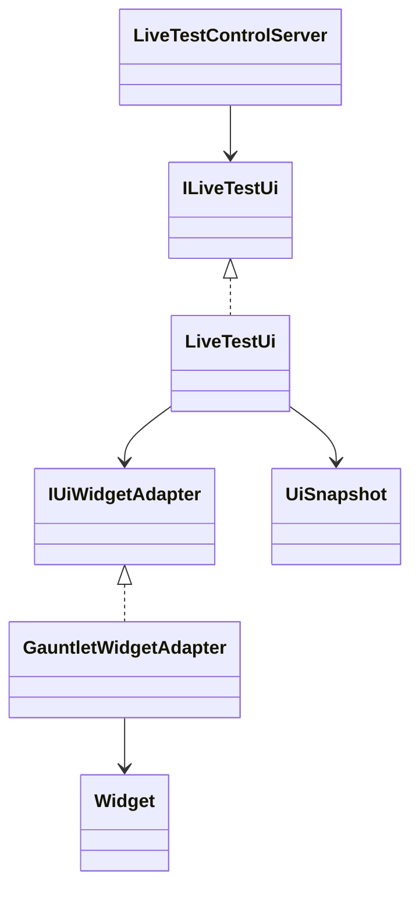
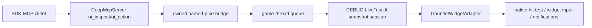

# MCP Gauntlet menu automation

## Scope

DEBUG-only, owned client processes. Inspect the top screen's active Gauntlet layers and discover controls by widget id, type, displayed text and parent/child hierarchy. Click ordinary buttons (including dropdown openers/items), set toggles, replace ordinary text, set native slider values, and scroll panels. No OS input, gameplay keys, arbitrary VM members, script execution, or automatic mutation retry.

Snapshots have opaque references, a 30-second lifetime, 128-element pages, and hard limits of 16384 widgets and 48 levels. Ordinary options on the tested game version contains 7925 widgets including hidden controls; larger trees remain inspection-only. Screen/layer/tree replacement invalidates references. Structural traversal finishes before native hit tests; truncated trees skip hit testing entirely. Before an action, recheck the target's identity, content, visibility, enabled state, clipping and native hit target. Controls whose displayed text or value exceeds 128 characters are inspection-only, because truncated content cannot validate a stale reference. Password fields and their descendants are redacted and cannot be edited. Unsupported/custom input types fail closed. Dropdowns use open, inspect again, click visible item; no hidden-item selection shortcut. Scroll then inspect again.

Dense campaign map nameplate trees can exceed the 16384-widget cap; `truncated: true` snapshots are inspection-only and reject all actions. For co-op settings, use `options_menu` to open the options screen, then take a fresh `ui_inspect` snapshot there. This does not provide complete campaign-map widget automation.

## Design

The bridge owns a small DEBUG Autofac scope so inspection also works before joining a campaign. Services are transient registrations retained by that bridge session, not global statics. Publicized native members are bound directly. Mouse overrides exist only inside a try/finally during native press/release; existing overrides are restored. Settings changes are real UI actions, not preview-only changes, and may require the menu's Apply button. Discrete sliders retain native step rounding. Text and slider actions reject controller-active or pending/active platform-keyboard input before changing focus or values. Do not click world-changing UI during menu verification.

## Client startup

`/autoconnect` works in Debug and Release. A bare flag retains the existing client/server defaults; `/autoconnect localhost:4200` selects an explicit client endpoint (hostnames, IPv4 and bracketed IPv6 are supported). Malformed endpoints or duplicate flags do not fall back to the default server. MCP's DEBUG `/cooptestmanualjoin` still prevents startup joining until the owned `join_client` request; UI-only checks do not need to join.

## Verification

Native widget tests cover notifications, mouse dispatch/cleanup, focus cleanup, password redaction, clipping, hidden/disabled targets, numeric/text limits and large-tree bounds. Snapshot tests cover paging, stale identities/content and consumed references after failures. These do not prove the renderer.

A historical bounded SDK live check of the generic UI candidate (before staged launch, preflight, and PNG capture were added) opened vanilla Options, changed and restored a toggle, a discrete slider and a dropdown, scrolled Performance down and back, then canceled/discarded pending changes. Saved Games text was set to `Danustica`, restored to empty and canceled without loading or deleting a save. No Apply or campaign join was used. A completed scroll screenshot and captured text/restored-options images were inspected. Text/restored screenshot-status polling missed its deadline, so those images are not claimed as MCP-completed captures. That historical evidence does not validate the combined candidate.

A separate direct Pi MCP check of the combined candidate selected `MP`, started only the server, added and joined one client, and reached the same campaign on both. It returned a completed rendered Chat options PNG, inspected a complete 422-widget options tree, clicked the discovered Map Time tab through `ui_action`, and closed without Apply. The campaign map tree hit the cap and no action was attempted there. Both owned process trees exited and the temporary module install was restored. This check did not repeat text/slider/toggle/scroll exercises or test Release `/autoconnect`; Release runtime remains unrun.
